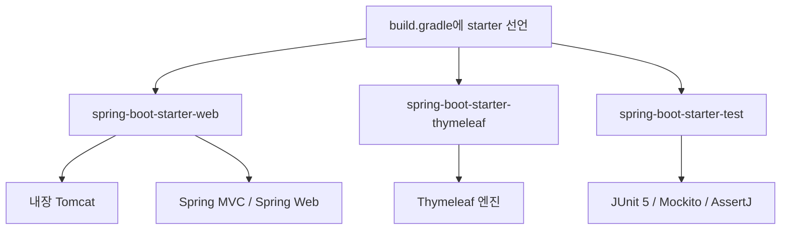

<!-- learning-issue-id: spring-0001 -->

# 1. 프로젝트 환경 설정

> 강의자료: `1. 프로젝트 환경 설정.pdf`  
> 현재 프로젝트 기준: Spring Boot `3.5.16` / Java `17` / Gradle Groovy DSL  
> 참고: [Thymeleaf 공식](https://www.thymeleaf.org/) · [스프링 튜토리얼](https://spring.io/guides/gs/serving-web-content/) · [스프링부트 메뉴얼](https://docs.spring.io/spring-boot/docs/2.3.1.RELEASE/reference/html/spring-boot-features.html#boot-features-spring-mvc-template-engines)

---

## 버전 선택

강의자료의 예전 `build.gradle` 설정을 그대로 따라야 하는지, H2와 JDK 버전은 어떻게 맞춰야 하는지 확인했다.

- 강의자료의 `2.3.1.RELEASE`, `sourceCompatibility = '11'`은 Boot 2.x 기준이라 그대로 복사하지 않는다.
- Boot 3.x에서는 Java 17 이상을 사용하고, `javax.*` 대신 `jakarta.*` 패키지를 사용한다.
- H2는 Boot 3.x 기준 `2.1.214` 이상이 맞고, 로컬의 `2.2.224`를 그대로 사용할 수 있다.
- IntelliJ에서 Project SDK와 Gradle JVM을 모두 JDK 17로 맞춰야 한다.

---

## 라이브러리 살펴보기

`build.gradle`에 starter 몇 개만 추가해도 실제로는 훨씬 많은 라이브러리가 함께 들어온다. Gradle이 선언한 라이브러리뿐 아니라 그 라이브러리가 의존하는 하위 라이브러리까지 자동으로 가져오기 때문이다.

- **Gradle Dependencies**: 내가 `build.gradle`에 직접 선언한 의존성
- **External Libraries**: Gradle이 해석한 결과로 실제 프로젝트에 들어온 전체 라이브러리

### 현재 build.gradle 선언

```groovy
dependencies {
    implementation 'org.springframework.boot:spring-boot-starter-thymeleaf'
    implementation 'org.springframework.boot:spring-boot-starter-web'
    testImplementation 'org.springframework.boot:spring-boot-starter-test'
    testRuntimeOnly 'org.junit.platform:junit-platform-launcher'
}
```

### starter가 끌고 오는 주요 라이브러리

| 내가 선언한 starter | 함께 들어오는 라이브러리 |
| --- | --- |
| `spring-boot-starter-web` | 내장 Tomcat, Spring MVC, Spring Web |
| `spring-boot-starter-thymeleaf` | Thymeleaf 엔진, thymeleaf-spring6 |
| `spring-boot-starter-test` | JUnit 5, Mockito, AssertJ, Spring Test |
| (공통) `spring-boot-starter` | spring-context, spring-core, Logback, SLF4J |

`spring-boot-starter-web` 하나만 추가해도 별도 Tomcat 설치 없이 `HelloSpringApplication` 실행 시 웹 서버가 함께 뜨는 이유가 내장 Tomcat이 자동으로 딸려오기 때문이다.



즉 `starter`는 기능 하나를 직접 구현하는 단일 라이브러리가 아니라, 그 기능에 필요한 라이브러리 묶음의 **진입점**이다. Gradle이 이 의존관계 그래프를 따라가며 실제 실행에 필요한 하위 라이브러리까지 준비한다.

### 로그 구조

코드에서 로그를 남길 때는 SLF4J API를 사용하고, 실제 출력은 Logback이 담당한다. 둘을 분리한 이유는 나중에 Logback 대신 다른 구현체로 교체해도 코드를 바꾸지 않아도 되기 때문이다.

---

## HTML charset 선언

강의에서 나오는 아래 태그의 의미를 정리했다.

```html
<meta http-equiv="Content-Type" content="text/html; charset=UTF-8" />
```

| 속성/값 | 설명 |
| --- | --- |
| `http-equiv="Content-Type"` | HTTP 응답 헤더의 `Content-Type`을 HTML 안에서 선언하는 속성 |
| `content="text/html; charset=UTF-8"` | 문서 타입은 `text/html`, 문자 인코딩은 UTF-8 |

UTF-8은 한글을 포함한 전 세계 문자를 하나의 인코딩으로 표현할 수 있다. 선언하지 않으면 브라우저가 인코딩을 추측하다가 한글이 깨질 수 있다.

HTML5에서는 아래처럼 짧게 써도 동일한 의미이고, 현재 프로젝트에서는 이 방식을 사용한다.

```html
<meta charset="UTF-8" />
```

반드시 `<head>` 안에서 가장 먼저 위치시켜야 브라우저가 파싱 시작과 동시에 인코딩을 인식할 수 있다.

---

## MVC 동작 흐름


① **브라우저 요청** — 주소창에 `localhost:8080/hello` 입력 → GET 요청 발생

② **내장 Tomcat 수신** — `spring-boot-starter-web`이 끌고 온 내장 서버가 요청을 받음. 별도 설치 불필요

③ **Controller 실행** — `@GetMapping("/hello")`가 달린 `HelloController.hello()` 호출. Spring이 `Model` 객체를 자동 주입

④ **뷰 이름 반환** — `return "hello"`로 뷰 이름 전달. `Model`에 담긴 데이터도 함께 넘어감

⑤ **viewResolver** — 뷰 이름 `"hello"`를 받아 `templates/hello.html` 경로로 변환 후 Thymeleaf에 전달

⑥ **Thymeleaf 렌더링 후 응답** — `th:text` 등을 실제 데이터로 채워 완성된 HTML을 브라우저에 전송

---

## Thymeleaf 템플릿 엔진

서버에서 HTML을 동적으로 만들어 브라우저에 내려주는 템플릿 엔진이다.  
`resources/templates/` 아래 HTML 파일을 읽고, 컨트롤러가 넘긴 데이터를 `th:*` 속성으로 채워서 완성된 HTML을 응답한다.

### Hello World 기본 구조

**컨트롤러** (`controller/HelloController.java`)

```java
@Controller
public class HelloController {

    @GetMapping("/hello")
    public String hello(Model model) {
        model.addAttribute("data", "hello!!");
        return "hello"; // → templates/hello.html 을 찾아서 렌더링
    }
}
```

**템플릿** (`resources/templates/hello.html`)

```html
<!DOCTYPE HTML>
<html xmlns:th="http://www.thymeleaf.org">
<head>
    <meta charset="UTF-8" />
    <title>Hello</title>
</head>
<body>
<p th:text="'안녕하세요. ' + ${data}">안녕하세요. 손님</p>
</body>
</html>
```

태그 안의 `안녕하세요. 손님`은 기본값으로, 서버 없이 HTML 파일만 열었을 때 보인다. Thymeleaf의 장점 중 하나다.

**요청 흐름**

```
브라우저 GET /hello
    → HelloController.hello() 실행
    → model에 data="hello!!" 추가
    → "hello" 반환
    → Thymeleaf가 templates/hello.html 렌더링
    → <p>안녕하세요. hello!!</p> 로 완성해서 응답
```

### 파일 위치 규칙

| 파일 종류 | 위치 | 설명 |
| --- | --- | --- |
| 템플릿 (동적 HTML) | `resources/templates/` | Thymeleaf가 렌더링하는 파일 |
| 정적 파일 (HTML/CSS/JS) | `resources/static/` | 서버 처리 없이 그대로 내려주는 파일 |

`static/index.html`은 `http://localhost:8080/` 루트 접속 시 자동으로 반환되는 웰컴 페이지다.

### 자주 쓰는 th:* 속성

| 속성 | 역할 |
| --- | --- |
| `th:text="${변수}"` | 태그 텍스트를 변수 값으로 교체 |
| `th:href="@{/경로}"` | 링크 경로 설정 |
| `th:each="item : ${list}"` | 반복 렌더링 |
| `th:if="${조건}"` | 조건부 렌더링 |
| `th:value="${변수}"` | input 값 설정 |

### 메뉴얼에서 봐야 할 부분

| 항목 | 내용 |
| --- | --- |
| `7.1.10 Template Engines` | Thymeleaf 자동설정, 기본 경로(`templates/`), 캐시 설정 |
| `7.1.5 Static Content` | 정적 파일 위치(`static/`), 웰컴 페이지 동작 방식 |

개발 중에는 템플릿 수정 후 바로 반영되게 캐시를 끈다.

```properties
spring.thymeleaf.cache=false
```

---

## 개념 정리

### 웹 진입점이란?

브라우저가 URL을 입력하면 요청이 서버로 날아온다. 서버 안에서 그 요청을 **처음 받아서 처리를 시작하는 지점**이 진입점이다.  
Spring Boot에서는 `@GetMapping` 같은 어노테이션이 붙은 **컨트롤러 메서드**가 진입점 역할을 한다.

```
브라우저 → GET /hello → HelloController.hello() ← 여기가 진입점
```

### viewResolver란?

컨트롤러가 `return "hello"`로 **문자열 뷰 이름**만 반환하면, viewResolver가 그 이름을 받아 **실제 파일 경로로 변환**해서 Thymeleaf에 넘겨주는 역할을 한다.

```
return "hello"
    → viewResolver
    → "classpath:/templates/hello.html"
    → Thymeleaf 렌더링
```

Spring Boot + Thymeleaf 조합에서는 `ThymeleafViewResolver`가 자동 등록되고, 규칙은 아래처럼 고정돼 있다.

```
prefix: classpath:/templates/
suffix: .html

→ "hello"  =  templates/hello.html
→ "member/list"  =  templates/member/list.html
```

개발자가 직접 경로를 붙이지 않아도 되는 이유가 viewResolver가 대신 조립해주기 때문이다.

**Kotlin과 비슷한가?**

동작 방식 자체는 비슷하지 않다. Kotlin의 `when` 표현식처럼 값을 매핑하는 느낌이 있지만, viewResolver는 런타임에 문자열을 파일 경로로 변환하는 Spring 내부 컴포넌트다.

단, **Spring Boot를 Kotlin으로 작성해도 viewResolver 동작은 완전히 동일**하다. Java 대신 Kotlin 문법을 쓸 뿐이다.

```kotlin
// Kotlin으로 쓴 컨트롤러 — viewResolver 동작은 Java와 동일
@Controller
class HelloController {

    @GetMapping("/hello")
    fun hello(model: Model): String {
        model.addAttribute("data", "hello!!")
        return "hello"  // viewResolver가 templates/hello.html 로 해석
    }
}
```

Spring이 JVM 위에서 동작하기 때문에 Java든 Kotlin이든 컴파일 후 동일한 바이트코드가 되고, viewResolver는 그 바이트코드를 실행하는 시점에 뷰 이름을 처리한다.

### 컨트롤러란?

사용자의 HTTP 요청을 받아서 **어떤 데이터를 준비하고 어떤 화면을 보여줄지 결정**하는 클래스다.  
요리로 비유하면 주문을 받고 주방(서비스)에 지시하고 결과를 손님(브라우저)에게 전달하는 홀 직원 역할이다.

### 패키지로 만드는 이유

Java에서 패키지(`controller`, `service`, `repository` 등)는 파일을 역할별로 묶는 폴더다.  
기능적으로는 없어도 동작하지만 두 가지 이유로 쓴다.

1. **Spring 자동 탐색 범위 기준이 된다.** `@SpringBootApplication`이 있는 클래스 패키지 하위를 스캔하므로 패키지 바깥에 두면 Spring이 인식하지 못한다.
2. **역할 구분으로 유지보수성이 높아진다.** 프로젝트가 커질수록 어디에 뭐가 있는지 명확해진다.

### 어노테이션이란?

`@`로 시작하는 메타데이터 표시다. 코드 자체를 실행하지는 않고 "이 클래스/메서드/필드는 이런 역할이야"라고 Spring에게 알려주는 라벨 역할을 한다.

```java
@Controller           // "이 클래스는 컨트롤러야"
@GetMapping("/hello") // "GET /hello 요청이 오면 이 메서드 실행해"
```

Spring은 어노테이션을 읽고 필요한 처리를 대신 해준다. 개발자가 직접 요청을 파싱하거나 라우팅 코드를 짤 필요가 없어지는 것이 핵심 이점이다.

어노테이션 없이 직접 구현하면 아래처럼 URL을 일일이 꺼내고 분기해야 한다.

```java
// 어노테이션 없이 순수 Java로 직접 파싱/라우팅하는 예시 (Servlet 방식)
protected void service(HttpServletRequest request, HttpServletResponse response) {
    String uri = request.getRequestURI();  // "/hello" 직접 꺼냄
    String method = request.getMethod();   // "GET" 직접 꺼냄

    if (method.equals("GET") && uri.equals("/hello")) {
        String name = request.getParameter("name"); // 쿼리 파라미터도 직접 꺼냄
        response.getWriter().write("<p>안녕하세요 " + name + "</p>"); // HTML도 직접 작성
    } else if (method.equals("GET") && uri.equals("/bye")) {
        // ...
    } else {
        response.setStatus(404);
    }
}
```

`@GetMapping("/hello")`와 `Model` 하나로 이 코드 전체를 대체한다.

### @GetMapping이란?

HTTP GET 요청과 특정 URL 경로를 이 메서드에 연결하는 어노테이션이다. 브라우저 주소창에 URL을 입력하거나 링크를 클릭하면 GET 요청이 발생한다.

| 어노테이션 | HTTP 메서드 | 주요 용도 |
| --- | --- | --- |
| `@GetMapping` | GET | 페이지 조회, 데이터 읽기 |
| `@PostMapping` | POST | 폼 제출, 데이터 생성 |
| `@PutMapping` | PUT | 데이터 수정 |
| `@DeleteMapping` | DELETE | 데이터 삭제 |

### Model 클래스란?

컨트롤러에서 Thymeleaf 템플릿으로 데이터를 전달하는 그릇이다. Map처럼 키-값 쌍으로 데이터를 담는다.

```java
model.addAttribute("data", "hello!!");
//                   ↑키       ↑값
```

템플릿에서는 키 이름으로 꺼내 쓴다.

```html
<p th:text="${data}">기본값</p>
<!-- "hello!!" 로 교체됨 -->
```

Spring이 메서드 파라미터에 `Model`이 있으면 자동으로 만들어서 주입해준다. 직접 `new Model()`로 생성하지 않아도 된다.

즉 이렇게 쓰지 않아도 된다는 뜻이다.

```java
// 직접 생성하는 경우 (Spring 없이 순수 Java 방식이라면 이렇게 해야 함)
Model model = new Model();
hello(model);
```

Spring이 `hello(Model model)`을 호출할 때 파라미터 목록을 보고 `Model` 타입이 있으면 알아서 객체를 만들어서 채워 넣어준다. 개발자는 그냥 파라미터에 `Model model`이라고 써두기만 하면 된다.

```java
// Spring이 알아서 Model 객체를 만들어서 넘겨줌
@GetMapping("/hello")
public String hello(Model model) {  // ← 여기 선언만 하면 됨
    model.addAttribute("data", "hello!!");
    return "hello";
}
```

이 동작 방식을 **의존성 주입(DI, Dependency Injection)** 이라고 부른다. 필요한 객체를 내가 직접 만드는 게 아니라 Spring이 만들어서 넣어주는 것이다. Spring의 핵심 개념 중 하나로, 뒤 강의에서 더 깊게 다룬다.

### xmlns란?

**XML NameSpace**의 줄임말이다. XML/HTML에서 속성 이름 충돌을 막기 위해 출처를 명시하는 선언이다.

```html
<html xmlns:th="http://www.thymeleaf.org">
```

HTML 표준에는 `th:text` 같은 속성이 없다. `th:`로 시작하는 속성이 Thymeleaf 것임을 알 수 있도록 출처 URL을 별칭(`th`)에 매핑하는 것이다.  
URL 자체에 실제로 접속하는 게 아니라 이름표 역할만 한다.

### Java / JDK / javac / java 차이

| 용어 | 뜻 | 역할 |
| --- | --- | --- |
| **Java** | 프로그래밍 언어 | 개발자가 코드를 작성하는 언어 자체 |
| **JDK** | Java Development Kit | Java 개발에 필요한 도구 모음. `javac` + `java` + 디버거 등 포함 |
| **JRE** | Java Runtime Environment | 실행만 할 때 필요한 최소 환경. JVM 포함. JDK 안에 포함돼 있음 |
| **javac** | Java Compiler | `.java` 소스 파일을 `.class` 바이트코드로 **컴파일**하는 도구 |
| **java** | Java 실행기 | `.class` 또는 `.jar` 파일을 JVM 위에서 **실행**하는 도구 |

```
개발자가 할 일          도구       결과
HelloController.java  →  javac  →  HelloController.class
HelloController.class →  java   →  실제 프로그램 실행
```

`java -jar hello-spring.jar`에서 `java`가 바로 이 실행기다. JDK를 설치하면 `javac`와 `java` 둘 다 딸려온다.

IntelliJ에서 빌드 버튼을 누르면 내부적으로 `javac`가 호출되고, 실행 버튼을 누르면 `java`가 호출된다.

### JVM이란?

**Java Virtual Machine**의 줄임말로, Java 바이트코드를 실제 OS 위에서 실행해주는 가상 머신이다.

```
HelloController.java   ← 개발자가 작성하는 소스 코드
       ↓ javac 컴파일
HelloController.class  ← JVM이 읽는 바이트코드
       ↓ JVM 실행
실제 CPU / OS           ← Windows, Mac, Linux 상관없이 동일하게 동작
```

Java가 "한 번 작성하면 어디서나 실행(Write Once, Run Anywhere)"되는 이유가 JVM 덕분이다. `.class` 바이트코드는 OS에 종속되지 않고, JVM이 각 OS에 맞게 번역해서 실행한다.

Spring Boot의 Fat JAR도 결국 `java -jar` 명령으로 JVM 위에서 돌아간다. Kotlin으로 작성해도 JVM 바이트코드로 컴파일되므로 동작 방식이 동일하다.

### 컨트롤러 수정 시 왜 서버를 다시 실행해야 하나?

Java는 `.java` 소스 파일을 **JVM이 읽을 수 있는 `.class` 바이트코드로 컴파일**한 뒤 실행한다. 서버가 한 번 뜨면 JVM은 그 시점의 `.class` 파일을 메모리에 올려두고 계속 쓴다.

```
HelloController.java
       ↓ 컴파일
HelloController.class  ← JVM이 이걸 메모리에 올려서 실행 중
```

코드를 수정하면 `.java`만 바뀌고 JVM 메모리 안의 `.class`는 그대로다. 그래서 수정 내용이 반영되려면 서버를 껐다 켜서 JVM이 새 `.class`를 다시 읽게 해야 한다.

**Spring Boot DevTools로 자동 재시작**

`build.gradle`에 아래를 추가하면 코드 저장 시 자동으로 재시작해준다.

```groovy
implementation 'org.springframework.boot:spring-boot-devtools'
```

단, 완전한 "재시작"이지 즉각 반영은 아니다. DevTools는 클래스 변경을 감지해서 서버를 빠르게 재시작하는 방식이다. HTML/CSS 같은 정적 파일은 재시작 없이 바로 반영된다.

| 변경 대상 | DevTools 없이 | DevTools 있을 때 |
| --- | --- | --- |
| Java 코드 (컨트롤러 등) | 수동 재시작 필요 | 자동 재시작 |
| `templates/` HTML | 수동 재시작 필요 | 자동 재시작 |
| `static/` HTML·CSS·JS | 수동 재시작 필요 | 재시작 없이 즉시 반영 |

### HTTP 상태 코드란?

브라우저가 서버에 요청을 보내면 서버는 결과와 함께 **3자리 숫자 코드**를 응답한다. 요청이 어떻게 처리됐는지를 나타낸다.

| 코드 | 의미 | 언제 보이나 |
| --- | --- | --- |
| `200 OK` | 요청 성공 | 페이지 정상 응답 |
| `201 Created` | 생성 성공 | POST로 데이터를 새로 만들었을 때 |
| `301 Moved Permanently` | 영구 이동 | URL이 바뀌어서 새 주소로 리다이렉트 |
| `400 Bad Request` | 잘못된 요청 | 클라이언트가 요청을 잘못 보냈을 때 |
| `404 Not Found` | 리소스 없음 | 해당 URL에 매핑된 컨트롤러가 없을 때 |
| `500 Internal Server Error` | 서버 내부 오류 | 컨트롤러에서 예외가 터졌을 때 |

앞자리 숫자로 대략적인 분류를 알 수 있다.

- `2xx` : 성공
- `3xx` : 리다이렉트
- `4xx` : 클라이언트 잘못 (요청 문제)
- `5xx` : 서버 잘못 (코드 문제)

Spring Boot에서 `@GetMapping("/hello")`를 안 만들고 `/hello`를 요청하면 `404`가 뜨는 이유가 매핑된 메서드를 찾지 못했기 때문이다.

### localhost:8080 과 / /hello 의 차이

```
http://localhost:8080/hello
       ↑         ↑    ↑
      호스트     포트  경로(path)
```

| 부분 | 의미 |
| --- | --- |
| `localhost` | 내 컴퓨터를 가리키는 호스트명. `127.0.0.1`과 동일 |
| `8080` | Spring Boot 내장 Tomcat이 기본으로 열어두는 포트 번호 |
| `/` | 루트 경로. `static/index.html`이 웰컴 페이지로 자동 응답 |
| `/hello` | `@GetMapping("/hello")`가 처리하는 경로 |

`localhost:8080`은 "내 컴퓨터의 8080번 문을 두드려"이고, 그 뒤의 `/`, `/hello`는 "그 문 안에서 어느 방으로 갈지"를 결정한다.

---

## 빌드 및 실행

### gradlew 실행 방법

`./`는 Linux/Mac 셸 문법이라 Windows cmd에서는 인식하지 못한다.

| 환경 | 명령어 |
| --- | --- |
| Windows cmd | `gradlew bootRun` 또는 `gradlew.bat bootRun` |
| PowerShell | `.\gradlew bootRun` |
| Linux / Mac | `./gradlew bootRun` |

### gradlew.bat이 "배치 작업"이라고 뜨는 이유

`.bat`이 Windows **배치(Batch) 파일** 확장자이기 때문이다. 배치 파일은 명령어 여러 개를 순서대로 실행하는 Windows 스크립트다. `gradlew.bat` 안에는 `java -jar gradle...` 같은 명령어들이 담겨 있고, Gradle 팀이 Windows용으로 만들어둔 것이다. Linux/Mac에서는 확장자 없는 `gradlew` 셸 스크립트를 대신 쓴다.

### 주요 gradlew 명령어

| 명령어 | 설명 |
| --- | --- |
| `gradlew bootRun` | 서버 실행 (개발 중 가장 많이 씀) |
| `gradlew build` | 컴파일 + 테스트 + JAR 생성 |
| `gradlew clean` | `build/` 폴더 전체 삭제 |
| `gradlew clean build` | 이전 빌드 결과 지우고 처음부터 새로 빌드 |
| `gradlew test` | 테스트만 실행 |
| `gradlew tasks` | 사용 가능한 전체 태스크 목록 출력 |

`clean build`를 함께 쓰는 이유는 이전 빌드 캐시가 남아서 오류가 생길 때 확실하게 초기화하기 위해서다. 뭔가 이상할 때 `clean build` 한 번이면 대부분 해결된다.

### 빌드 결과물 (build/libs/)

`gradlew build` 실행 후 `build/libs/` 아래에 두 개의 JAR 파일이 생긴다.

| 파일 | 크기 | 설명 |
| --- | --- | --- |
| `hello-spring-0.0.1-SNAPSHOT.jar` | ~22MB | **Fat JAR** — 내 코드 + Spring + Tomcat + Thymeleaf 전부 포함. 이걸로 실행 |
| `hello-spring-0.0.1-SNAPSHOT-plain.jar` | ~2KB | 내가 직접 작성한 클래스 파일만 포함. 라이브러리가 없어서 단독 실행 불가 |

용량 차이(2KB vs 22MB)가 라이브러리 포함 여부의 차이다.

**Fat JAR 실행:**

```cmd
java -jar hello-spring-0.0.1-SNAPSHOT.jar
```

`plain.jar`로 실행하면 Spring 코드가 없으니 바로 오류가 난다.

---

## 확인 체크리스트

- [ ] `HelloSpringApplication` 기본 클래스 실행 확인
- [ ] `http://localhost:8080` 접속 확인
- [ ] `@GetMapping` + `Model` + `return "뷰이름"` 흐름 이해
- [ ] `templates/hello.html` 만들고 `th:text` 동작 확인
- [ ] `static/index.html` 웰컴 페이지 확인
- [ ] Markdown 학습 기록 확인
