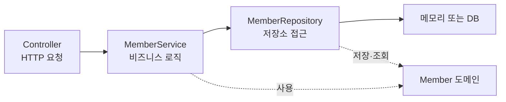
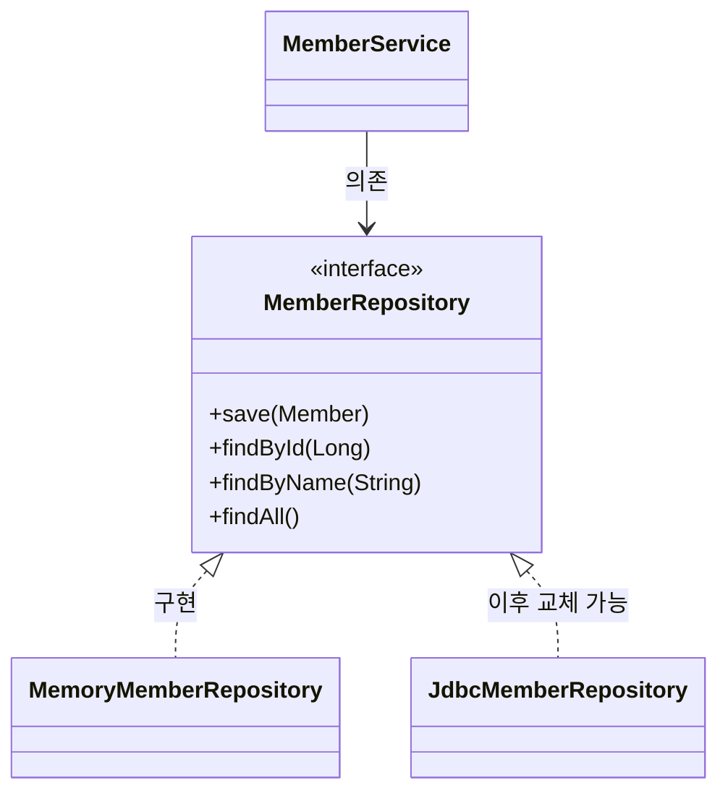

<!-- learning-issue-id: spring-0003 -->

# 3. 회원 관리 예제 - 백엔드 개발

> 강의자료: `3. 회원 관리 예제 - 백엔드 개발.pdf`  
> 현재 프로젝트 기준: Spring Boot `3.5.16` / Java `17` / Gradle Groovy DSL

---

## 비즈니스 요구사항 정리

- **데이터**: 회원ID, 이름
- **기능**: 회원 등록, 조회
- **제약**: 아직 데이터 저장소가 선정되지 않음 (가상의 시나리오)

### 일반적인 웹 애플리케이션 계층 구조



| 계층 | 역할 |
| --- | --- |
| 컨트롤러 | 웹 MVC의 컨트롤러 역할. HTTP 요청 수신 |
| 서비스 | 핵심 비즈니스 로직 구현 |
| 리포지토리 | 데이터베이스에 접근, 도메인 객체를 DB에 저장하고 관리 |
| 도메인 | 비즈니스 도메인 객체 (회원, 주문, 쿠폰 등) — 주로 DB에 저장하고 관리됨 |

### 클래스 의존관계



- 아직 데이터 저장소가 선정되지 않아서 **인터페이스**로 구현 클래스를 교체할 수 있도록 설계
- 초기 개발 단계에서는 구현체로 **메모리 기반 저장소** 사용

> 인터페이스를 먼저 두고 구현체를 나중에 갈아끼우는 패턴이다. 실제 DB가 결정되면 `MemoryMemberRepository` 대신 새 구현체를 꽂으면 `MemberService` 코드는 수정하지 않아도 된다.

서비스는 `MemberRepository`라는 **역할**만 바라본다. 따라서 저장 방식이 메모리에서 JDBC로 바뀌어도 서비스의 회원 가입 규칙은 그대로 유지할 수 있다.

---

## 회원 도메인과 리포지토리 만들기

### 회원 객체 (domain)

```java
package hello.hellospring.domain;

public class Member {
    private Long id;
    private String name;

    public Long getId() { return id; }
    public void setId(Long id) { this.id = id; }
    public String getName() { return name; }
    public void setName(String name) { this.name = name; }
}
```

- `id`는 시스템이 자동 부여하는 식별자 (사용자가 정하는 이름이 아님)
- getter/setter는 자바빈 규약 — Jackson 직렬화나 프레임워크 내부에서 사용

### 회원 리포지토리 인터페이스

```java
package hello.hellospring.repository;

import hello.hellospring.domain.Member;
import java.util.List;
import java.util.Optional;

public interface MemberRepository {
    Member save(Member member);
    Optional<Member> findById(Long id);
    Optional<Member> findByName(String name);
    List<Member> findAll();
}
```

### `Optional<T>`이란?

null을 직접 반환하는 대신 감싸서 반환하는 컨테이너. 값이 없을 수 있음을 타입으로 표현해 NPE를 방지한다.

```java
result.get();                 // 값 꺼내기
result.orElse(new Member());  // 없으면 기본값
result.ifPresent(m -> ...);   // 있을 때만 실행
```

### 회원 리포지토리 메모리 구현체

```java
package hello.hellospring.repository;

import hello.hellospring.domain.Member;
import java.util.*;

public class MemoryMemberRepository implements MemberRepository {
    private static Map<Long, Member> store = new HashMap<>();
    private static long sequence = 0L;

    @Override
    public Member save(Member member) {
        member.setId(++sequence);
        store.put(member.getId(), member);
        return member;
    }

    @Override
    public Optional<Member> findById(Long id) {
        return Optional.ofNullable(store.get(id));
    }

    @Override
    public List<Member> findAll() {
        return new ArrayList<>(store.values());
    }

    @Override
    public Optional<Member> findByName(String name) {
        return store.values().stream()
                .filter(member -> member.getName().equals(name))
                .findAny();
    }

    public void clearStore() {
        store.clear();
    }
}
```

#### 주요 포인트

| 코드 | 설명 |
| --- | --- |
| `private static Map<Long, Member> store` | 인스턴스가 여러 개여도 공유되는 저장소 (static) |
| `private static long sequence` | 자동 증가 ID 카운터 |
| `Optional.ofNullable(...)` | null이 올 수 있을 때 사용. null이면 `Optional.empty()` 반환 |
| `store.values().stream().filter(...).findAny()` | 스트림으로 조건 검색 후 하나 반환 |

> **동시성 주의**: 예제는 단순화를 위해 `HashMap`, `long`을 사용했다. 실무에서는 멀티스레드 환경을 고려해 `ConcurrentHashMap`, `AtomicLong`을 사용해야 한다.

---

## 회원 리포지토리 테스트 케이스 작성

main 메서드나 컨트롤러를 직접 실행해서 테스트하면 **준비 시간이 길고, 반복 실행이 어렵고, 여러 테스트를 한 번에 돌리기 어렵다**. Java는 **JUnit** 프레임워크로 이 문제를 해결한다.

### 테스트 위치

```
src/test/java/hello/hellospring/repository/MemoryMemberRepositoryTest.java
```

### 테스트 코드

```java
package hello.hellospring.repository;

import hello.hellospring.domain.Member;
import org.junit.jupiter.api.AfterEach;
import org.junit.jupiter.api.Test;
import java.util.List;
import static org.assertj.core.api.Assertions.*;

class MemoryMemberRepositoryTest {
    MemoryMemberRepository repository = new MemoryMemberRepository();

    @AfterEach
    public void afterEach() {
        repository.clearStore();
    }

    @Test
    public void save() {
        //given
        Member member = new Member();
        member.setName("spring");
        //when
        repository.save(member);
        //then
        Member result = repository.findById(member.getId()).get();
        assertThat(result).isEqualTo(member);
    }

    @Test
    public void findByName() {
        //given
        Member member1 = new Member();
        member1.setName("spring1");
        repository.save(member1);

        Member member2 = new Member();
        member2.setName("spring2");
        repository.save(member2);
        //when
        Member result = repository.findByName("spring1").get();
        //then
        assertThat(result).isEqualTo(member1);
    }

    @Test
    public void findAll() {
        //given
        Member member1 = new Member();
        member1.setName("spring1");
        repository.save(member1);

        Member member2 = new Member();
        member2.setName("spring2");
        repository.save(member2);
        //when
        List<Member> result = repository.findAll();
        //then
        assertThat(result.size()).isEqualTo(2);
    }
}
```

#### assertEquals 실패 시

`Assertions.assertEquals(expected, actual)`에서 값이 다르면 테스트가 실패하고 IntelliJ에서 아래와 같은 출력이 뜬다.

```
expected: <Member@...> but was: <null>
org.opentest4j.AssertionFailedError
```

어떤 값을 기대했는데 실제로 무엇이 왔는지 메시지로 알 수 있다.

### 테스트 어노테이션

| 어노테이션 | 타이밍 | 용도 |
| --- | --- | --- |
| `@Test` | — | 테스트 메서드 표시 |
| `@AfterEach` | 각 테스트 **종료 후** | 상태 초기화 (저장소 비우기) |
| `@BeforeEach` | 각 테스트 **시작 전** | 새 객체 생성, 의존관계 설정 |

### given / when / then 패턴

테스트 코드의 표준 구성 방식이다.

```
given  : 테스트에 필요한 데이터 준비
when   : 실제 테스트할 동작 실행
then   : 결과 검증 (assertThat)
```

> **테스트는 각각 독립적으로 실행되어야 한다.** 테스트 순서에 의존관계가 생기면 좋은 테스트가 아니다. `@AfterEach`로 매 테스트 후 저장소를 초기화하는 이유가 여기 있다.

### AssertJ 검증

```java
assertThat(result).isEqualTo(member);       // 객체가 같은지
assertThat(result.size()).isEqualTo(2);     // 크기가 같은지
assertThat(e.getMessage()).isEqualTo("...");// 예외 메시지 검증
```

`org.assertj.core.api.Assertions`를 static import 해서 사용한다.

---

## 회원 서비스 개발

### 초기 코드 (리포지토리를 서비스 내부에서 직접 생성)

```java
public class MemberService {
    private final MemberRepository memberRepository = new MemoryMemberRepository();

    public Long join(Member member) {
        validateDuplicateMember(member); // 중복 회원 검증
        memberRepository.save(member);
        return member.getId();
    }

    private void validateDuplicateMember(Member member) {
        memberRepository.findByName(member.getName())
                .ifPresent(m -> {
                    throw new IllegalStateException("이미 존재하는 회원입니다.");
                });
    }

    public List<Member> findMembers() {
        return memberRepository.findAll();
    }

    public Optional<Member> findOne(Long memberId) {
        return memberRepository.findById(memberId);
    }
}
```

#### `ifPresent`로 중복 검증하기

```java
memberRepository.findByName(member.getName())
        .ifPresent(m -> {
            throw new IllegalStateException("이미 존재하는 회원입니다.");
        });
```

`Optional.ifPresent()`는 값이 존재할 때만 람다를 실행한다. 중복 회원이 있으면 예외를 던지는 로직을 간결하게 표현한다.

### DI(Dependency Injection) 가능하게 리팩토링

초기 코드에서는 `MemberService`가 `MemoryMemberRepository`를 직접 생성한다. 이러면 테스트에서 서비스와 테스트가 **서로 다른 저장소 인스턴스**를 사용하게 되는 문제가 생긴다.

**해결**: 생성자로 외부에서 주입받도록 변경한다.

```java
public class MemberService {
    private final MemberRepository memberRepository;

    public MemberService(MemberRepository memberRepository) {
        this.memberRepository = memberRepository;
    }
    // ...
}
```

이렇게 하면 `MemberService`가 어떤 저장소를 쓸지를 외부에서 결정한다 — **의존성 주입(DI)**.

---

## 회원 서비스 테스트

```java
package hello.hellospring.service;

import hello.hellospring.domain.Member;
import hello.hellospring.repository.MemoryMemberRepository;
import org.junit.jupiter.api.AfterEach;
import org.junit.jupiter.api.BeforeEach;
import org.junit.jupiter.api.Test;
import static org.assertj.core.api.Assertions.*;
import static org.junit.jupiter.api.Assertions.*;

class MemberServiceTest {
    MemberService memberService;
    MemoryMemberRepository memberRepository;

    @BeforeEach
    public void beforeEach() {
        memberRepository = new MemoryMemberRepository();
        memberService = new MemberService(memberRepository);
    }

    @AfterEach
    public void afterEach() {
        memberRepository.clearStore();
    }

    @Test
    public void 회원가입() throws Exception {
        //Given
        Member member = new Member();
        member.setName("hello");
        //When
        Long saveId = memberService.join(member);
        //Then
        Member findMember = memberRepository.findById(saveId).get();
        assertEquals(member.getName(), findMember.getName());
    }

    @Test
    public void 중복_회원_예외() throws Exception {
        //Given
        Member member1 = new Member();
        member1.setName("spring");
        Member member2 = new Member();
        member2.setName("spring");
        //When
        memberService.join(member1);
        IllegalStateException e = assertThrows(IllegalStateException.class,
                () -> memberService.join(member2));
        //Then
        assertThat(e.getMessage()).isEqualTo("이미 존재하는 회원입니다.");
    }
}
```

### `@BeforeEach`와 DI의 연결

```
@BeforeEach
  ↓
memberRepository = new MemoryMemberRepository();  // 테스트용 저장소 새로 생성
memberService = new MemberService(memberRepository); // 같은 저장소를 주입
```

서비스와 테스트가 **동일한 저장소 인스턴스**를 공유하게 되어, 테스트에서 저장소 상태를 직접 검증할 수 있다.

### 예외 테스트: `assertThrows`

```java
IllegalStateException e = assertThrows(
    IllegalStateException.class,
    () -> memberService.join(member2) // 이 코드가 예외를 던져야 함
);
assertThat(e.getMessage()).isEqualTo("이미 존재하는 회원입니다.");
```

`assertThrows`는 람다 안의 코드가 지정한 예외를 던지면 성공하고, 던진 예외 객체를 반환한다. 예외 메시지까지 검증할 수 있다.

---

## 개념 정리

### 레이어 분리 이유

```
컨트롤러  → HTTP 요청/응답 담당. 비즈니스 로직 없음
서비스    → 비즈니스 로직 (중복 가입 금지 등). DB 접근 코드 없음
리포지토리 → DB 접근 코드만. 비즈니스 로직 없음
도메인    → 데이터 구조만
```

각 계층이 자신의 역할만 하면, 한 계층을 수정해도 다른 계층에 영향이 없다.

### 테스트 이름을 한글로 짓는 이유

```java
@Test
public void 회원가입() { ... }

@Test
public void 중복_회원_예외() { ... }
```

테스트 메서드는 production 코드에서 호출하지 않는다. 한글로 쓰면 **테스트의 의도를 명확하게** 표현할 수 있어서 실무에서도 많이 사용한다.

### 용어 정리

| 용어 | 설명 |
| --- | --- |
| DI (Dependency Injection) | 필요한 객체를 직접 생성하지 않고 외부에서 주입받는 것 |
| `Optional<T>` | null 대신 사용하는 컨테이너. 값이 없을 수도 있음을 명시 |
| `@AfterEach` | 각 테스트 종료 후 실행 — 상태 초기화용 |
| `@BeforeEach` | 각 테스트 시작 전 실행 — 객체 초기화 및 의존관계 설정 |
| `assertThrows` | 예외가 발생해야 성공하는 테스트 검증 |
| given/when/then | 테스트 코드 구성 패턴 (준비 / 실행 / 검증) |

---

## IntelliJ 단축키

| 단축키 | 기능 |
| --- | --- |
| `Ctrl + Space` | 자동 완성 |
| `Ctrl + /` | 현재 줄 주석 처리 / 해제 |
| `Ctrl + P` | 메서드 괄호 안에서 매개변수 타입 확인 |
| `Ctrl + Shift + T` | 현재 클래스의 테스트 파일 생성 / 이동 |
| `Alt + Insert` | 코드 생성 (getter/setter, 생성자 등) |
| `Ctrl + Shift + F10` | 현재 커서 위치 테스트/파일 실행 |
| `Shift + F10` | 마지막으로 실행한 항목 다시 실행 |
| `Shift + F6` | Rename — 변수/메서드/클래스 이름 전체 일괄 변경 |
| `Ctrl + Alt + V` | 반환값을 변수로 자동 추출 (Extract Variable) |

---

## 확인 체크리스트

- [ ] `Member` 도메인 클래스 작성
- [ ] `MemberRepository` 인터페이스 작성
- [ ] `MemoryMemberRepository` 구현체 작성
- [ ] `MemoryMemberRepositoryTest` 작성 및 전체 테스트 통과 확인
- [ ] `MemberService` 작성 (중복 가입 검증 포함)
- [ ] `MemberService`를 DI 가능하게 리팩토링
- [ ] `MemberServiceTest` 작성 (회원가입, 중복 회원 예외 테스트)
- [ ] `@BeforeEach`로 같은 저장소 인스턴스 공유 확인
