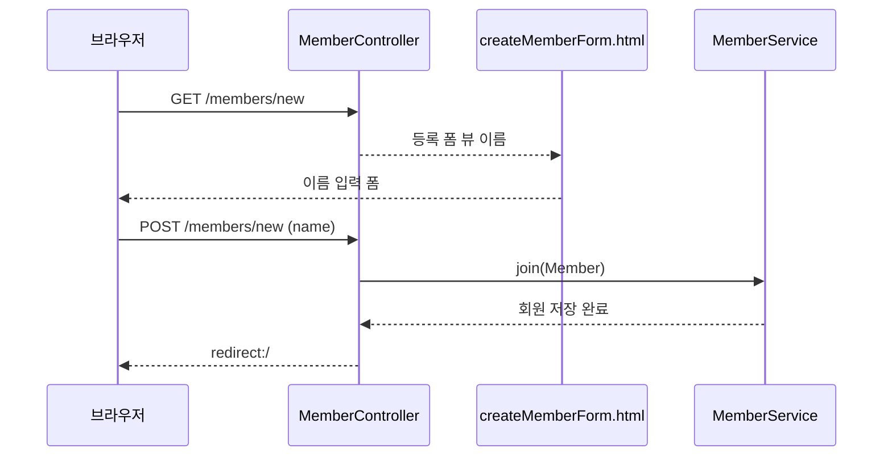

<!-- learning-issue-id: spring-0005 -->

# 5. 회원 관리 예제 - 웹 MVC 개발

> 강의자료: `5. 회원 관리 예제 - 웹 MVC 개발.pdf`  
> 현재 프로젝트 기준: Spring Boot `3.5.16` / Java `17` / Gradle Groovy DSL

---

## 요약

- 홈 화면, 회원 등록 폼, 회원 등록 처리, 회원 목록 조회를 **웹 MVC**로 구현한다.
- 컨트롤러가 URL 요청을 받아 비즈니스 로직을 호출하고, 그 결과를 **Thymeleaf 템플릿**으로 렌더링한다.
- `@GetMapping`은 화면 조회·폼 출력, `@PostMapping`은 폼 데이터 전송(등록)에 쓴다.
- 등록 후에는 `redirect:/`로 홈으로 돌려보낸다.
- 오늘 실제로 만난 에러: `Ambiguous mapping`(같은 URL을 두 메서드가 매핑).

---

## 회원 웹 기능 - 홈 화면 추가

```java
@Controller
public class HomeController {

    @GetMapping("/")
    public String home() {
        return "home";        // templates/home.html
    }
}
```

```html
<!-- templates/home.html -->
<!DOCTYPE HTML>
<html xmlns:th="http://www.thymeleaf.org">
<body>
<div class="container">
    <div>
        <h1>Hello Spring</h1>
        <p>회원 기능</p>
        <p>
            <a href="/members/new">회원 가입</a>
            <a href="/members">회원 목록</a>
        </p>
    </div>
</div>
</body>
</html>
```

### 정적 `index.html`이 무시되는 이유

- 원래 루트(`/`) 요청은 `static/index.html`(정적 컨텐츠)이 응답한다.
- 그런데 `@GetMapping("/")`을 등록하면 **컨트롤러가 우선**한다.
- 스프링은 요청이 오면 **먼저 컨트롤러에서 매핑을 찾고**, 없을 때만 정적 리소스를 찾기 때문이다.

> 우선순위: **컨트롤러 매핑 > 정적 컨텐츠.** 그래서 `home()`이 매핑된 순간 `index.html`은 무시된다.

---

## 회원 등록 폼

```java
@Controller
public class MemberController {
    private final MemberService memberService;

    @Autowired
    public MemberController(MemberService memberService) {
        this.memberService = memberService;
    }

    @GetMapping("/members/new")          // 등록 폼 화면 보여주기
    public String createForm() {
        return "members/createMemberForm";
    }
}
```

```html
<!-- templates/members/createMemberForm.html -->
<!DOCTYPE HTML>
<html xmlns:th="http://www.thymeleaf.org">
<body>
<div class="container">
    <form action="/members/new" method="post">
        <div class="form-group">
            <label for="name">이름</label>
            <input type="text" id="name" name="name" placeholder="이름을 입력하세요">
        </div>
        <button type="submit">등록</button>
    </form>
</div>
</body>
</html>
```

- `GET /members/new` → 등록 폼 HTML을 보여준다.
- 폼은 `action="/members/new" method="post"` → **등록 버튼을 누르면 POST로 전송**된다.



같은 URL을 사용해도 HTTP 메서드가 다르므로 역할이 분리된다. `GET`은 폼을 **조회**하고, `POST`는 폼 데이터를 받아 회원을 **변경·저장**한다.

---

## 회원 등록 처리

### 폼 데이터를 받는 객체

```java
public class MemberForm {
    private String name;     // input name="name" 과 매칭

    public String getName() { return name; }
    public void setName(String name) { this.name = name; }
}
```

### POST 처리 컨트롤러

```java
@PostMapping("/members/new")             // 폼 제출(등록) 처리
public String create(MemberForm form) {
    Member member = new Member();
    member.setName(form.getName());

    memberService.join(member);          // 비즈니스 로직 호출 → 저장

    return "redirect:/";                 // 등록 후 홈으로 이동
}
```

| 단계 | 설명 |
| --- | --- |
| `MemberForm form` | 폼의 `name` 값이 `setName()`을 통해 자동으로 담긴다 |
| `member.setName(...)` | 폼 값으로 도메인 객체 생성 |
| `memberService.join(member)` | 서비스 → 리포지토리로 저장 |
| `return "redirect:/"` | 화면을 그리지 않고 홈 URL로 **리다이렉트** |

> 폼 입력 `name="name"` ↔ `MemberForm.setName()`이 이름으로 매칭된다. 그래서 폼 필드 이름과 객체 프로퍼티 이름을 맞춰야 한다.

---

## 회원 목록 조회

```java
@GetMapping("/members")
public String list(Model model) {
    List<Member> members = memberService.findMembers();
    model.addAttribute("members", members);   // 모델에 담아 뷰로 전달
    return "members/memberList";
}
```

```html
<!-- templates/members/memberList.html -->
<!DOCTYPE HTML>
<html xmlns:th="http://www.thymeleaf.org">
<body>
<div class="container">
    <div>
        <table>
            <thead>
                <tr><th>#</th><th>이름</th></tr>
            </thead>
            <tbody>
                <tr th:each="member : ${members}">
                    <td th:text="${member.id}"></td>
                    <td th:text="${member.name}"></td>
                </tr>
            </tbody>
        </table>
    </div>
</div>
</body>
</html>
```

| 문법 | 설명 |
| --- | --- |
| `model.addAttribute("members", members)` | 컨트롤러 → 뷰로 데이터 전달 |
| `th:each="member : ${members}"` | 리스트를 반복하며 `<tr>` 생성 (for-each) |
| `th:text="${member.name}"` | 객체의 값을 텍스트로 출력 |

> 컨트롤러에서 `model`에 담은 `members`를 템플릿에서 `${members}`로 꺼내 `th:each`로 행을 반복 출력한다.

---

## 트러블슈팅 (오늘 실제로 만난 에러)

### `Ambiguous mapping. Cannot map ... There is already ... mapped`

```text
java.lang.IllegalStateException: Ambiguous mapping.
Cannot map 'memberController' method ...MemberController#createForm()
to {GET [/members/new]}: There is already 'homeController' bean method
...HomeController#createHome() mapped.
```

- **증상**: 앱 실행 시 시작하다가 죽음 (`APPLICATION FAILED TO START`).
- **원인**: **같은 URL(`GET /members/new`)을 두 메서드가 동시에 매핑**. 스프링은 하나의 URL = 하나의 핸들러여야 하는데 둘이라 충돌.
  - `HomeController.createHome()` → `@GetMapping("/members/new")`  ← 잘못 들어간 중복
  - `MemberController.createForm()` → `@GetMapping("/members/new")`
- **해결**: 역할에 맞게 **`HomeController`에서 중복 메서드를 제거**한다. `HomeController`는 홈(`/`)만 담당하고, `/members/new`는 `MemberController`가 처리한다.

> 한 URL을 두 곳에서 처리하려고 하면 충돌이다. 컨트롤러를 나눌 때 **URL이 겹치지 않도록** 역할을 분리한다.

---

## 동작 흐름 정리

```
[브라우저]  GET /                → HomeController.home()        → home.html
[브라우저]  GET /members/new     → MemberController.createForm()→ createMemberForm.html
[폼 제출]   POST /members/new    → MemberController.create()    → join() → redirect:/
[브라우저]  GET /members         → MemberController.list()      → memberList.html (th:each)
```

---

## 용어 정리

| 용어 | 설명 |
| --- | --- |
| `@GetMapping` | HTTP GET 요청을 메서드에 매핑 (조회·폼 출력) |
| `@PostMapping` | HTTP POST 요청을 메서드에 매핑 (폼 전송·등록) |
| `Model` | 컨트롤러가 뷰로 데이터를 전달하는 객체 |
| `redirect:` | 뷰를 렌더링하지 않고 지정 URL로 다시 요청 |
| `th:each` | Thymeleaf 반복 문법 (리스트 순회) |
| `th:text` | Thymeleaf 텍스트 출력 문법 |
| Ambiguous mapping | 같은 URL을 둘 이상이 매핑해 충돌하는 에러 |

---

## 확인 체크리스트

- [ ] `HomeController`로 홈 화면(`/`) 추가
- [ ] 정적 `index.html`이 무시되는 우선순위 이해
- [ ] `GET /members/new`로 등록 폼 출력
- [ ] `MemberForm`으로 폼 데이터 받기
- [ ] `POST /members/new`로 회원 등록 후 `redirect:/`
- [ ] `GET /members` + `th:each`로 회원 목록 출력
- [ ] URL 중복 매핑(Ambiguous mapping) 충돌을 역할 분리로 해결
