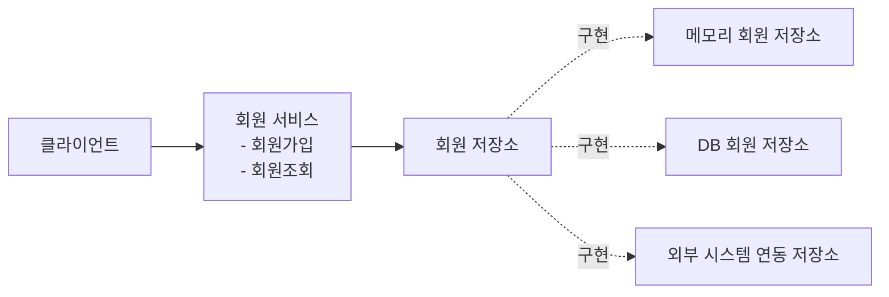
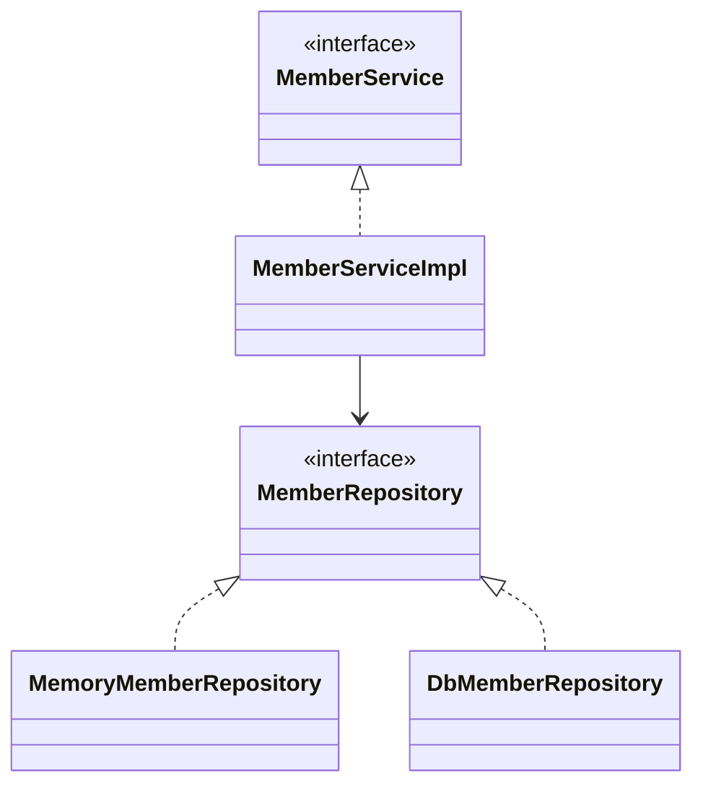
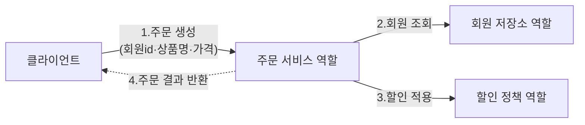
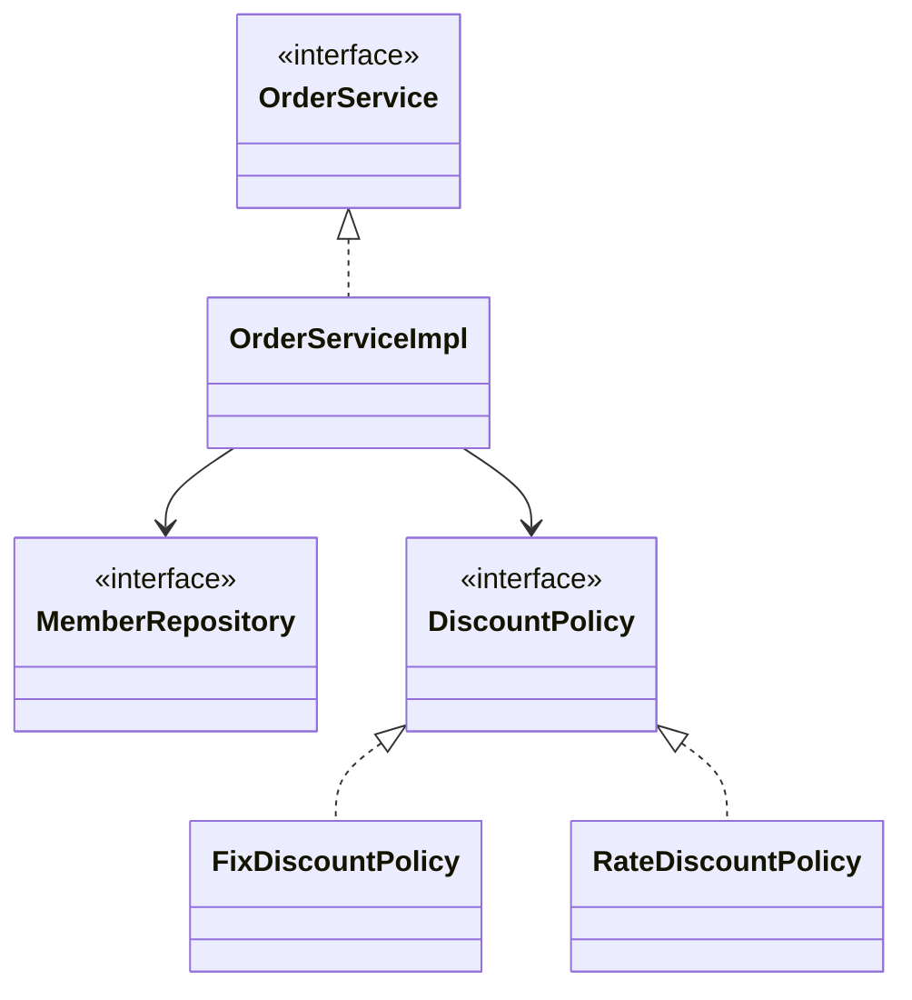

<!-- learning-chapter: core-02 -->

# 2. 스프링 핵심 원리 이해1 - 예제 만들기

> 강의자료: `2. 스프링 핵심 원리 이해1 - 예제 만들기.pdf`
> 실습 코드: `study/core` (groupId `hello`, artifactId `core`)
> 핵심: **스프링 없이 순수 자바로** 회원·주문·할인 도메인을 만든다. 스프링은 한참 뒤에 등장한다.

> [!NOTE]
> 이 문서는 학습 **전** PDF 기준으로 미리 정리한 내용이다. 실습하며 챕터 단위로 커밋하고, 커밋 내용을 근거로 이후 보충한다.

---

## 프로젝트 생성

[start.spring.io](https://start.spring.io) 에서 생성한다.

| 항목 | 값 |
| --- | --- |
| Project | Gradle - Groovy |
| Spring Boot | 4.x (강의 PDF는 3.x 기준, 아래 참고) |
| Language | Java |
| Packaging | Jar |
| Java | 17 또는 21 |
| groupId | `hello` |
| artifactId | `core` |
| Dependencies | **선택하지 않음** |

- 강의 PDF는 Boot 3.x 기준이지만, `start.spring.io`에서 **2.x에 이어 3.x도 지원이 종료**되어 지금은 선택할 수 없다. 그래서 현재 `study/core`는 **Boot 4.1.0 / Java 17**로 세팅했다.
- Boot 3.0부터 이미 적용된 변경점(**Java 17 이상 필수**, 패키지 `javax.*` → `jakarta.*`, H2 `2.1.214` 이상)은 4.x에도 그대로 유지된다.
- 이 장은 스프링 기능을 거의 쓰지 않는 **순수 자바 예제**라, 부트 버전이 3.x든 4.x든 도메인 코드는 동일하게 동작한다.
- 스프링 부트 스타터만 넣고 별도 의존성은 추가하지 않는다. 이 장은 **순수 자바 예제**라서 웹/DB 스타터가 필요 없다.

> [!TIP]
> 스프링 부트 3.2 이상이면 IntelliJ의 `Build and run using` / `Run tests using`는 **Gradle**로 두어야 오류가 없다. Gradle JVM은 Java 17 이상으로 지정한다.

동작 확인: 기본 메인 클래스 `CoreApplication.main()` 실행.

---

## 비즈니스 요구사항과 설계

### 회원

- 회원을 **가입**하고 **조회**할 수 있다.
- 회원은 **일반(BASIC)** 과 **VIP** 두 등급이 있다.
- 회원 데이터는 자체 DB를 구축할 수도, 외부 시스템과 연동할 수도 있다. **(미확정)**

### 주문과 할인 정책

- 회원은 상품을 **주문**할 수 있다.
- 회원 등급에 따라 **할인 정책**을 적용한다.
- 할인 정책: 모든 VIP는 **1000원 고정 금액 할인**. (나중에 변경될 수 있음)
- 할인 정책은 **변경 가능성이 매우 높다.** 오픈 직전까지 미룰 수도, 최악의 경우 할인을 아예 안 할 수도 있다. **(미확정)**

> [!IMPORTANT]
> 미확정 요구사항(회원 저장소, 할인 정책) 때문에 개발을 무기한 미룰 수 없다. 그래서 **인터페이스를 만들고 구현체를 언제든 갈아끼울 수 있게** 설계한다. 이것이 이 장의 핵심 목표다.

---

## 회원 도메인 설계

### 협력 관계



- **역할(인터페이스)** 과 **구현(구현체)** 을 나눈다. 저장소가 아직 미확정이므로 `MemberRepository` 인터페이스를 두고, 우선 `MemoryMemberRepository`로 개발을 시작한다.

### 클래스 다이어그램



- 회원 서비스 구현체: `MemberServiceImpl`

---

## 회원 도메인 개발

### 회원 등급 — `member/Grade.java`

```java
package hello.core.member;

public enum Grade {
    BASIC,
    VIP
}
```

### 회원 엔티티 — `member/Member.java`

```java
package hello.core.member;

public class Member {
    private Long id;
    private String name;
    private Grade grade;

    public Member(Long id, String name, Grade grade) {
        this.id = id;
        this.name = name;
        this.grade = grade;
    }

    public Long getId() { return id; }
    public void setId(Long id) { this.id = id; }
    public String getName() { return name; }
    public void setName(String name) { this.name = name; }
    public Grade getGrade() { return grade; }
    public void setGrade(Grade grade) { this.grade = grade; }
}
```

### 회원 저장소 인터페이스 — `member/MemberRepository.java`

```java
package hello.core.member;

public interface MemberRepository {
    void save(Member member);
    Member findById(Long memberId);
}
```

### 메모리 회원 저장소 — `member/MemoryMemberRepository.java`

```java
package hello.core.member;

import java.util.HashMap;
import java.util.Map;

public class MemoryMemberRepository implements MemberRepository {

    private static Map<Long, Member> store = new HashMap<>();

    @Override
    public void save(Member member) {
        store.put(member.getId(), member);
    }

    @Override
    public Member findById(Long memberId) {
        return store.get(memberId);
    }
}
```

> [!NOTE]
> DB가 확정되지 않았어도 가장 단순한 메모리 저장소로 우선 개발을 진행한다. `HashMap`은 동시성 이슈가 있어 실무에서는 `ConcurrentHashMap`을 쓴다.

### 회원 서비스 인터페이스 — `member/MemberService.java`

```java
package hello.core.member;

public interface MemberService {
    void join(Member member);
    Member findMember(Long memberId);
}
```

### 회원 서비스 구현체 — `member/MemberServiceImpl.java`

```java
package hello.core.member;

public class MemberServiceImpl implements MemberService {

    private final MemberRepository memberRepository = new MemoryMemberRepository();

    public void join(Member member) {
        memberRepository.save(member);
    }

    public Member findMember(Long memberId) {
        return memberRepository.findById(memberId);
    }
}
```

---

## 회원 도메인 실행과 테스트

### 순수 자바 실행 — `MemberApp.java`

```java
package hello.core;

import hello.core.member.Grade;
import hello.core.member.Member;
import hello.core.member.MemberService;
import hello.core.member.MemberServiceImpl;

public class MemberApp {
    public static void main(String[] args) {
        MemberService memberService = new MemberServiceImpl();
        Member member = new Member(1L, "memberA", Grade.VIP);
        memberService.join(member);

        Member findMember = memberService.findMember(1L);
        System.out.println("new member = " + member.getName());
        System.out.println("find Member = " + findMember.getName());
    }
}
```

`main()`으로 확인하는 것은 좋은 방법이 아니다. **JUnit 테스트**를 쓴다.

### JUnit 테스트 — `test/.../member/MemberServiceTest.java`

```java
package hello.core.member;

import org.assertj.core.api.Assertions;
import org.junit.jupiter.api.Test;

class MemberServiceTest {

    MemberService memberService = new MemberServiceImpl();

    @Test
    void join() {
        //given
        Member member = new Member(1L, "memberA", Grade.VIP);
        //when
        memberService.join(member);
        Member findMember = memberService.findMember(1L);
        //then
        Assertions.assertThat(member).isEqualTo(findMember);
    }
}
```

### 회원 도메인 설계의 문제점

- 다른 저장소로 바꿀 때 **OCP**(개방-폐쇄 원칙)를 지키는가? → ❌
- **DIP**(의존관계 역전 원칙)를 지키는가? → ❌
- `MemberServiceImpl`이 인터페이스(`MemberRepository`)뿐 아니라 **구현(`MemoryMemberRepository`)까지 직접 의존**한다. 저장소를 바꾸면 서비스 코드를 고쳐야 한다.
- 주문까지 만든 뒤 다음 장에서 문제점과 해결책(스프링 컨테이너 / DI)을 설명한다.

---

## 주문과 할인 도메인 설계

### 주문 흐름 (역할·책임)



1. **주문 생성**: 클라이언트가 주문 서비스에 주문 생성을 요청한다.
2. **회원 조회**: 할인에 회원 등급이 필요해 회원 저장소에서 회원을 조회한다.
3. **할인 적용**: 회원 등급에 따른 할인 여부를 할인 정책에 **위임**한다.
4. **주문 결과 반환**: 할인 결과를 포함한 주문 결과를 반환한다. (실무는 DB 저장, 예제는 생략)

### 클래스 다이어그램



역할과 구현을 분리했기 때문에, 저장소를 메모리→DB로 바꾸거나 할인 정책을 정액→정률로 바꿔도 **주문 서비스는 변경하지 않는다.** 협력 관계를 그대로 재사용한다.

---

## 주문과 할인 도메인 개발

### 할인 정책 인터페이스 — `discount/DiscountPolicy.java`

```java
package hello.core.discount;

import hello.core.member.Member;

public interface DiscountPolicy {
    /**
     * @return 할인 대상 금액
     */
    int discount(Member member, int price);
}
```

### 정액 할인 정책 — `discount/FixDiscountPolicy.java`

```java
package hello.core.discount;

import hello.core.member.Grade;
import hello.core.member.Member;

public class FixDiscountPolicy implements DiscountPolicy {

    private int discountFixAmount = 1000; //1000원 할인

    @Override
    public int discount(Member member, int price) {
        if (member.getGrade() == Grade.VIP) {
            return discountFixAmount;
        } else {
            return 0;
        }
    }
}
```

VIP면 1000원 할인, 아니면 할인 없음.

### 주문 엔티티 — `order/Order.java`

```java
package hello.core.order;

public class Order {
    private Long memberId;
    private String itemName;
    private int itemPrice;
    private int discountPrice;

    public Order(Long memberId, String itemName, int itemPrice, int discountPrice) {
        this.memberId = memberId;
        this.itemName = itemName;
        this.itemPrice = itemPrice;
        this.discountPrice = discountPrice;
    }

    public int calculatePrice() {
        return itemPrice - discountPrice;
    }

    public Long getMemberId() { return memberId; }
    public String getItemName() { return itemName; }
    public int getItemPrice() { return itemPrice; }
    public int getDiscountPrice() { return discountPrice; }

    @Override
    public String toString() {
        return "Order{" +
                "memberId=" + memberId +
                ", itemName='" + itemName + '\'' +
                ", itemPrice=" + itemPrice +
                ", discountPrice=" + discountPrice +
                '}';
    }
}
```

### 주문 서비스 인터페이스 — `order/OrderService.java`

```java
package hello.core.order;

public interface OrderService {
    Order createOrder(Long memberId, String itemName, int itemPrice);
}
```

### 주문 서비스 구현체 — `order/OrderServiceImpl.java`

```java
package hello.core.order;

import hello.core.discount.DiscountPolicy;
import hello.core.discount.FixDiscountPolicy;
import hello.core.member.Member;
import hello.core.member.MemberRepository;
import hello.core.member.MemoryMemberRepository;

public class OrderServiceImpl implements OrderService {

    private final MemberRepository memberRepository = new MemoryMemberRepository();
    private final DiscountPolicy discountPolicy = new FixDiscountPolicy();

    @Override
    public Order createOrder(Long memberId, String itemName, int itemPrice) {
        Member member = memberRepository.findById(memberId);
        int discountPrice = discountPolicy.discount(member, itemPrice);

        return new Order(memberId, itemName, itemPrice, discountPrice);
    }
}
```

주문 생성 요청이 오면 회원을 조회하고, 할인 정책을 적용한 뒤 주문 객체를 만들어 반환한다.

> [!WARNING]
> `OrderServiceImpl`도 회원 도메인과 똑같이 **구현체(`MemoryMemberRepository`, `FixDiscountPolicy`)를 직접 `new`** 하고 있다. 이 DIP/OCP 위반이 다음 장의 리팩터링 대상이다.

---

## 주문과 할인 도메인 실행과 테스트

### 순수 자바 실행 — `OrderApp.java`

```java
package hello.core;

import hello.core.member.Grade;
import hello.core.member.Member;
import hello.core.member.MemberService;
import hello.core.member.MemberServiceImpl;
import hello.core.order.Order;
import hello.core.order.OrderService;
import hello.core.order.OrderServiceImpl;

public class OrderApp {
    public static void main(String[] args) {
        MemberService memberService = new MemberServiceImpl();
        OrderService orderService = new OrderServiceImpl();

        long memberId = 1L;
        Member member = new Member(memberId, "memberA", Grade.VIP);
        memberService.join(member);

        Order order = orderService.createOrder(memberId, "itemA", 10000);
        System.out.println("order = " + order);
    }
}
```

실행 결과:

```text
order = Order{memberId=1, itemName='itemA', itemPrice=10000, discountPrice=1000}
```

### JUnit 테스트 — `test/.../order/OrderServiceTest.java`

```java
package hello.core.order;

import hello.core.member.Grade;
import hello.core.member.Member;
import hello.core.member.MemberService;
import hello.core.member.MemberServiceImpl;
import org.assertj.core.api.Assertions;
import org.junit.jupiter.api.Test;

class OrderServiceTest {

    MemberService memberService = new MemberServiceImpl();
    OrderService orderService = new OrderServiceImpl();

    @Test
    void createOrder() {
        long memberId = 1L;
        Member member = new Member(memberId, "memberA", Grade.VIP);
        memberService.join(member);

        Order order = orderService.createOrder(memberId, "itemA", 10000);
        Assertions.assertThat(order.getDiscountPrice()).isEqualTo(1000);
    }
}
```

---

## 개념 정리

### 역할과 구현의 분리

- **역할 = 인터페이스**, **구현 = 구현 클래스**. 클라이언트는 역할(인터페이스)에만 의존하면 구현을 자유롭게 갈아끼울 수 있다.
- 저장소(메모리↔DB), 할인 정책(정액↔정률)을 바꿔도 이를 사용하는 서비스는 그대로 재사용된다 — 이것이 유연하고 변경에 강한 설계다.

### `enum`을 쓰는 이유

- `Grade`처럼 값이 고정된 집합(BASIC, VIP)은 `enum`으로 정의하면 타입 안전하다. 오타 문자열("vip") 대신 컴파일 시점에 검증되는 `Grade.VIP`를 쓴다.

### OCP와 DIP (이 장에서 "위반"으로 남겨둔 개념)

| 원칙 | 의미 | 이 장의 코드 |
| --- | --- | --- |
| **OCP** (개방-폐쇄) | 확장에는 열려 있고, 변경에는 닫혀 있어야 | 저장소/정책을 바꾸면 서비스 코드를 **수정해야 함 → 위반** |
| **DIP** (의존관계 역전) | 추상(인터페이스)에 의존해야, 구현에 의존 X | 서비스가 구현체를 직접 `new` **→ 위반** |

- 지금은 스프링을 쓰지 않으므로 구현체를 직접 생성할 수밖에 없다. 다음 장에서 **AppConfig**로 구현 생성을 외부로 분리하고, 이후 스프링 컨테이너/DI로 발전시켜 OCP·DIP를 지키도록 리팩터링한다.

### 왜 스프링 없이 순수 자바인가?

- 스프링 부트는 **프로젝트 환경설정 편의**를 위해 얹었을 뿐, 이 장의 도메인 코드는 전부 순수 자바다. 스프링의 핵심 원리(제어의 역전, DI)를 이해하려면 먼저 "스프링이 없을 때의 문제"를 체감해야 하기 때문이다.

---

## 왜 아직 컴포넌트 스캔·JPA가 없나 (자주 헷갈리는 점)

`MemoryMemberRepository`에 `@Repository`, `@Component`, `@Autowired`가 하나도 없다. **DB를 안 띄워서가 아니라, 이 강의가 일부러 스프링을 안 쓰는 순수 자바 단계이기 때문이다.**

- 2장의 목표는 "스프링이 **없을 때** 생기는 문제(OCP/DIP 위반)를 직접 겪기"다. 그래야 뒤에서 스프링이 그 문제를 어떻게 푸는지가 와닿는다.
- 스프링 기능은 강의 순서상 뒤에 등장한다.

| 장 | 등장하는 것 |
| --- | --- |
| 2장 (지금) | 순수 자바, 구현체 직접 `new` |
| 3장 | `AppConfig`로 생성 책임 분리 (아직 순수 자바 DI) |
| 4장 | `@Configuration` / `@Bean`, 스프링 컨테이너 |
| 6장 | **컴포넌트 스캔** (`@ComponentScan`, `@Component`, `@Autowired`) |
| 7장 | 의존관계 자동 주입 |

- **컴포넌트 스캔은 원래 6장**에 나온다. 안 쓰는 게 아니라 아직 배우기 전 단계일 뿐이다. 6장에 가면 이 클래스에 `@Repository`가 붙고 스캔 대상이 된다.
- **JPA는 이 "핵심 원리 - 기본편" 강의엔 아예 없다.** JPA는 입문 강의(DB 접근 기술)와 별도 JPA 강의에서 다룬다.
- 메모리(`HashMap`)를 쓴 건 요구사항상 **회원 DB가 미확정**이라 가장 단순한 저장소로 먼저 개발을 시작하려는 것. "DB가 안 떠서"가 아니라 "무엇을 쓸지 안 정해서 일단 메모리로"가 정확하다.
- 입문 강의는 빠른 동작이 목표라 `@Repository`+JPA를 바로 썼지만, 핵심 원리는 **IoC/DI의 원리를 이해**하는 게 목표라 순수 자바부터 쌓아 올린다.

---

## 확인 체크리스트

- [ ] `study/core` 프로젝트 생성 및 `CoreApplication` 실행 확인
- [ ] `member` 패키지: Grade / Member / MemberRepository / MemoryMemberRepository / MemberService / MemberServiceImpl 작성
- [ ] `MemberApp` 실행 + `MemberServiceTest.join()` 통과
- [ ] `order` / `discount` 패키지: DiscountPolicy / FixDiscountPolicy / Order / OrderService / OrderServiceImpl 작성
- [ ] `OrderApp` 실행 결과 `discountPrice=1000` 확인 + `OrderServiceTest.createOrder()` 통과
- [ ] OCP·DIP 위반 지점(구현체 직접 `new`)을 코드에서 짚어보기
