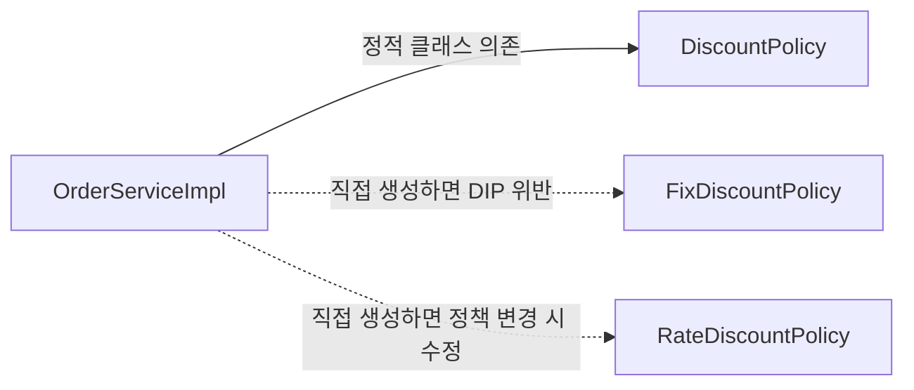
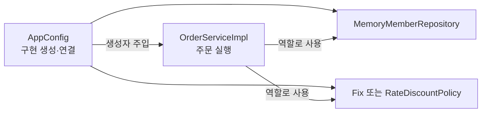
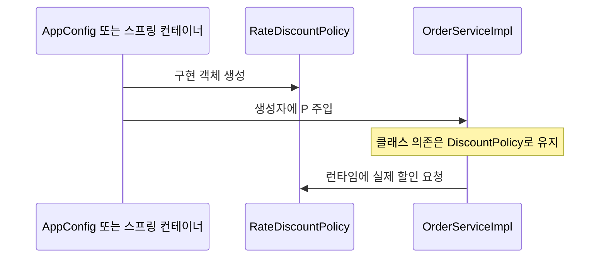

<!-- learning-chapter: core-03 -->

# 3. 스프링 핵심 원리 이해2 - 객체 지향 원리 적용

> 강의자료: `3. 스프링 핵심 원리 이해2 - 객체 지향 원리 적용.pdf`
> 실습 코드: `study/core` (groupId `hello`, artifactId `core`)
> 핵심: 02장에서 만든 순수 자바 예제에 **새 할인 정책을 확장**하며 OCP·DIP 위반을 마주하고, **AppConfig**로 관심사를 분리한 뒤 마지막에 **스프링 컨테이너**로 전환한다.

> [!NOTE]
> 이 문서는 학습 **전** PDF 기준으로 미리 정리한 내용이다. 실습하며 챕터 단위로 커밋하고, 커밋 내용을 근거로 이후 보충한다.

---

## 1. 새로운 할인 정책 개발

**요구사항 변경:** 고정 금액 할인(정액) → **주문 금액의 %를 할인(정률)** 로 변경.
- 기존: VIP는 얼마를 주문하든 **1000원** 할인
- 신규: **10%** → 10000원 주문 시 1000원, 20000원 주문 시 2000원 할인

다형성 덕분에 `DiscountPolicy`를 구현한 새 클래스를 추가하는 것 자체는 문제없다.

```java
public class RateDiscountPolicy implements DiscountPolicy {
    private int discountPercent = 10; // 10% 할인
    @Override
    public int discount(Member member, int price) {
        if (member.getGrade() == Grade.VIP) {
            return price * discountPercent / 100;
        }
        return 0;
    }
}
```

테스트는 **VIP 10% 할인 적용** / **BASIC은 할인 없음** 두 케이스로 검증한다.

---

## 2. 새로운 할인 정책 적용과 문제점

할인 정책을 바꾸려면 클라이언트인 `OrderServiceImpl` 코드를 직접 고쳐야 한다.

```java
public class OrderServiceImpl implements OrderService {
//  private final DiscountPolicy discountPolicy = new FixDiscountPolicy();
    private final DiscountPolicy discountPolicy = new RateDiscountPolicy(); // 여길 고쳐야 함
}
```

> [!WARNING]
> **역할과 구현을 분리하고 다형성도 썼지만, 실제로는 OCP·DIP를 위반하고 있었다.**
> - **DIP 위반**: `OrderServiceImpl`이 추상(`DiscountPolicy`)뿐 아니라 **구체 클래스(`FixDiscountPolicy`, `RateDiscountPolicy`)에도 의존**한다.
> - **OCP 위반**: 구현체를 바꾸는 순간 **클라이언트 코드도 변경**해야 한다.

**해결 방향:** 클라이언트가 **인터페이스에만 의존**하도록 바꾼다.

```java
public class OrderServiceImpl implements OrderService {
    private DiscountPolicy discountPolicy; // 인터페이스에만 의존
}
```

- 하지만 이러면 구현체가 없어 실행 시 **NPE**가 발생한다.
- **누군가가 구현 객체를 대신 생성해서 주입**해줘야 한다.



---

## 3. 관심사의 분리 — AppConfig 등장

> 애플리케이션을 하나의 **공연**으로 보자. 로미오 역할(인터페이스)의 배우가 줄리엣 역할 배우를 직접 초빙하면 **책임이 과하다.** 배우는 **연기(실행)** 에만 집중하고, 배역에 맞는 배우를 정하는 건 **공연 기획자**가 맡아야 한다.

**AppConfig**: 구현 객체를 **생성**하고 **연결(주입)** 하는 책임을 가진 별도의 설정 클래스.

```java
public class AppConfig {
    public MemberService memberService() {
        return new MemberServiceImpl(new MemoryMemberRepository());
    }
    public OrderService orderService() {
        return new OrderServiceImpl(
                new MemoryMemberRepository(),
                new FixDiscountPolicy());
    }
}
```

구현체들은 **생성자 주입**으로 바뀐다.

```java
public class OrderServiceImpl implements OrderService {
    private final MemberRepository memberRepository;
    private final DiscountPolicy discountPolicy;
    public OrderServiceImpl(MemberRepository memberRepository, DiscountPolicy discountPolicy) {
        this.memberRepository = memberRepository;
        this.discountPolicy = discountPolicy;
    }
}
```

- `OrderServiceImpl`은 이제 `FixDiscountPolicy`를 모른다. **어떤 구현체가 주입될지는 오직 외부(`AppConfig`)가 결정**한다.
- **DIP 완성**: 클라이언트는 추상에만 의존한다.
- **관심사의 분리**: 생성·연결 역할과 실행 역할이 명확히 나뉘었다.



> 클라이언트 입장에서 의존관계를 외부에서 주입해주는 것 같다 하여 **DI(Dependency Injection, 의존관계 주입)** 라 한다.

`MemberApp`, `OrderApp`, 그리고 테스트의 `@BeforeEach`에서 `new AppConfig()`로 서비스를 가져와 사용한다.

---

## 4. AppConfig 리팩터링

중복(`new MemoryMemberRepository()`)을 제거하고 **역할에 따른 구현**이 드러나도록 메서드로 분리한다.

```java
public class AppConfig {
    public MemberService memberService() {
        return new MemberServiceImpl(memberRepository());
    }
    public OrderService orderService() {
        return new OrderServiceImpl(memberRepository(), discountPolicy());
    }
    public MemberRepository memberRepository() {
        return new MemoryMemberRepository();
    }
    public DiscountPolicy discountPolicy() {
        return new FixDiscountPolicy();
    }
}
```

- 저장소 구현체를 바꿀 때 **한 곳만** 변경하면 된다.
- **역할과 구현 클래스가 한눈에** 들어와 전체 구성 파악이 쉽다.

---

## 5. 새로운 구조와 할인 정책 적용

이제 정액 → 정률 변경은 **AppConfig의 `discountPolicy()` 한 줄**만 고치면 된다.

```java
public DiscountPolicy discountPolicy() {
//  return new FixDiscountPolicy();
    return new RateDiscountPolicy();
}
```

> [!IMPORTANT]
> AppConfig의 등장으로 애플리케이션이 **사용 영역**과 **구성(Configuration) 영역**으로 분리되었다.
> 할인 정책을 바꿔도 **구성 영역만 변경**되고, `OrderServiceImpl`을 포함한 **사용 영역은 전혀 영향받지 않는다.**

---

## 6. 좋은 객체 지향 설계 5원칙 적용 (SRP·DIP·OCP)

| 원칙 | 적용 내용 |
| --- | --- |
| **SRP** 단일 책임 원칙 | 생성·연결 책임은 **AppConfig**가, 실행 책임은 **클라이언트**가 담당하도록 분리 |
| **DIP** 의존관계 역전 | 클라이언트가 추상(`DiscountPolicy`)에만 의존하고, AppConfig가 구현체를 **주입**해 문제 해결 |
| **OCP** 개방-폐쇄 | 사용/구성 영역 분리 + DI로, **확장(새 정책)해도 사용 영역 코드는 변경되지 않음** |

---

## 7. IoC, DI, 그리고 컨테이너

### 제어의 역전 IoC (Inversion of Control)

- 기존: 구현 객체가 **스스로** 필요한 객체를 생성·연결·실행하며 제어 흐름을 조종.
- AppConfig 이후: 구현 객체는 **자기 로직 실행만** 담당하고, **제어 흐름은 AppConfig가** 가져간다. → **제어의 역전(IoC)**

> **프레임워크 vs 라이브러리**: 내 코드를 **프레임워크가 제어·실행**하면 프레임워크(JUnit), 내 코드가 **직접 제어 흐름을 담당**하면 라이브러리다.

### 의존관계 주입 DI (Dependency Injection)

의존관계는 **두 가지**로 나눠 봐야 한다.

- **정적인 클래스 의존관계**: `import`만 봐도 알 수 있음. 실행 없이 분석 가능. (누가 주입될지는 모름)
- **동적인 객체 인스턴스 의존관계**: **실행 시점(런타임)** 에 외부에서 실제 객체를 생성·전달해 연결.

> **DI**: 정적인 클래스 의존관계를 바꾸지 않고, **동적인 객체 인스턴스 의존관계를 쉽게 변경**할 수 있다.



### IoC 컨테이너 / DI 컨테이너

AppConfig처럼 객체를 생성·관리하며 의존관계를 연결해주는 것을 **IoC 컨테이너** 또는 **DI 컨테이너**라 한다. (최근엔 주로 DI 컨테이너)

---

## 8. 스프링으로 전환하기

지금까지 순수 자바로 만든 DI를 스프링 기반으로 바꾼다.

```java
@Configuration
public class AppConfig {
    @Bean public MemberService memberService() { return new MemberServiceImpl(memberRepository()); }
    @Bean public OrderService orderService() { return new OrderServiceImpl(memberRepository(), discountPolicy()); }
    @Bean public MemberRepository memberRepository() { return new MemoryMemberRepository(); }
    @Bean public DiscountPolicy discountPolicy() { return new RateDiscountPolicy(); }
}
```

- `@Configuration`: 설정(구성) 정보임을 표시.
- `@Bean`: 해당 메서드가 반환한 객체를 **스프링 빈으로 등록**. 빈 이름은 **메서드명**(`memberService` 등).

사용하는 쪽은 `ApplicationContext`(스프링 컨테이너)를 통해 빈을 조회한다.

```java
ApplicationContext ac = new AnnotationConfigApplicationContext(AppConfig.class);
MemberService memberService = ac.getBean("memberService", MemberService.class);
```

- **스프링 컨테이너** = `ApplicationContext`. `@Configuration`이 붙은 `AppConfig`를 구성 정보로 사용해 `@Bean` 메서드를 호출하고 반환 객체를 **스프링 빈으로 등록**한다.
- 이전엔 개발자가 직접 조회했지만, 이제는 `applicationContext.getBean()`으로 찾는다.
- 결과는 기존과 동일. "코드가 더 복잡해진 것 같은데 무슨 장점이?" → **다음 장(스프링 컨테이너)에서** 다룬다.

> [!TIP]
> **스프링 부트 3.1 이상 로그 미출력 문제**: 기본 로그 레벨이 `INFO`라 DEBUG 로그가 안 보인다.
> `ApplicationContext`를 **직접 생성**해 쓰는 `MemberApp`/`OrderApp`의 경우, `src/main/resources/logback.xml`을 추가해 `<root level="DEBUG">`로 설정하면 강의와 같은 로그를 볼 수 있다. (스프링 부트로 실행하는 `CoreApplication`에서는 이 파일을 제거하거나 `INFO`로 둔다.)

---

## 전체 흐름 정리

1. **새 할인 정책 개발** — 다형성 덕에 추가 자체는 문제없음
2. **적용과 문제점** — 클라이언트가 구체 클래스에도 의존 → **DIP·OCP 위반**
3. **관심사의 분리** — 공연 기획자 **AppConfig** 등장, 생성/연결 책임 분리
4. **AppConfig 리팩터링** — 중복 제거, 역할·구현이 드러남
5. **새 구조 적용** — 정책 변경 시 **구성 영역만** 수정, 사용 영역 불변
6. **SOLID 적용** — SRP·DIP·OCP 달성
7. **IoC/DI/컨테이너** — 개념 정리
8. **스프링 전환** — `@Configuration`·`@Bean`·`ApplicationContext`로 DI 컨테이너 사용
