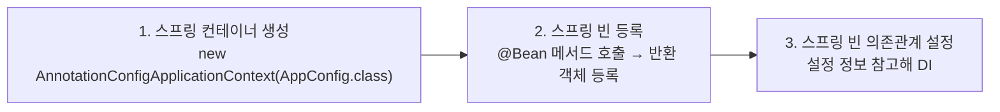
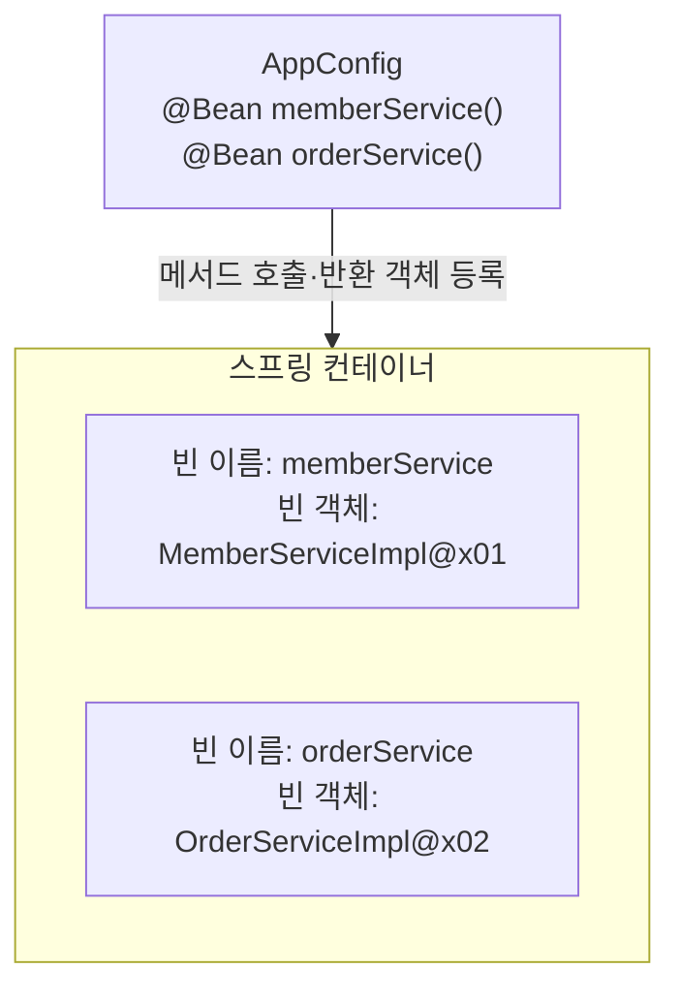
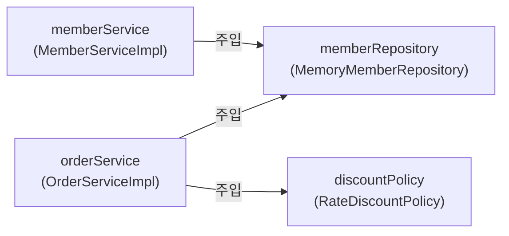
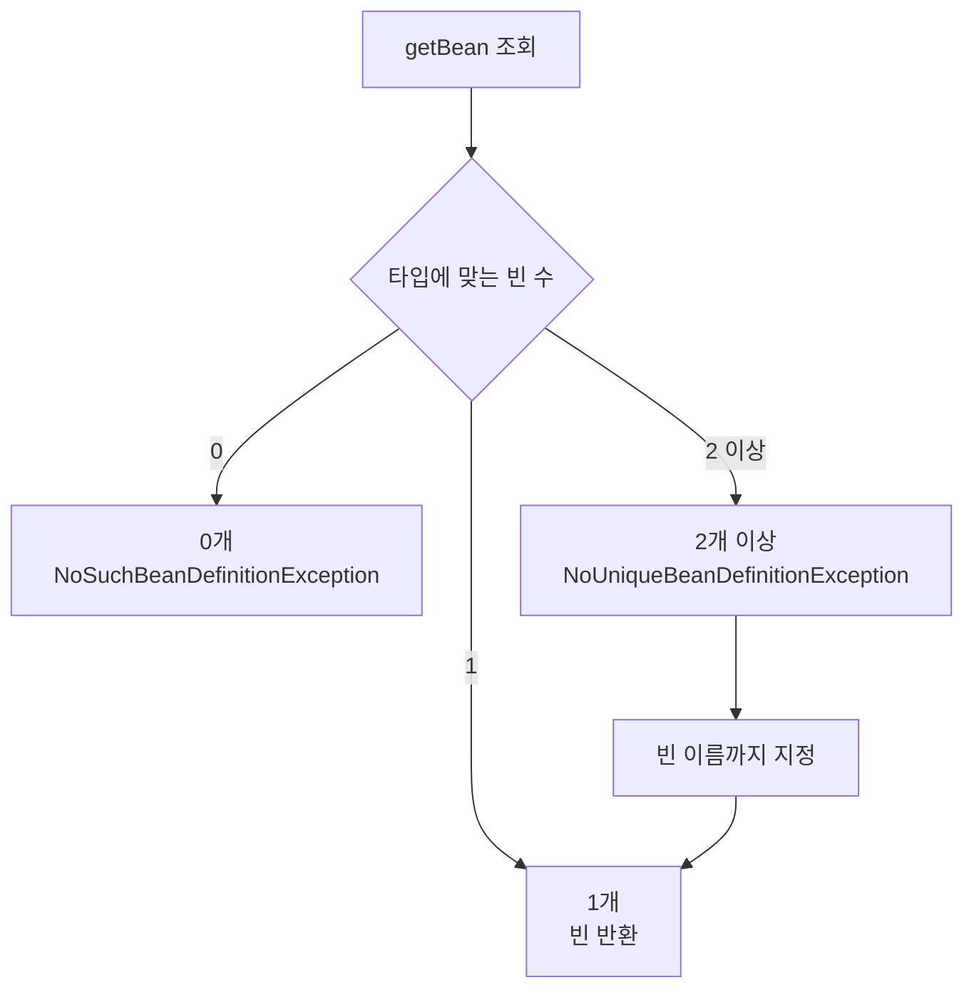
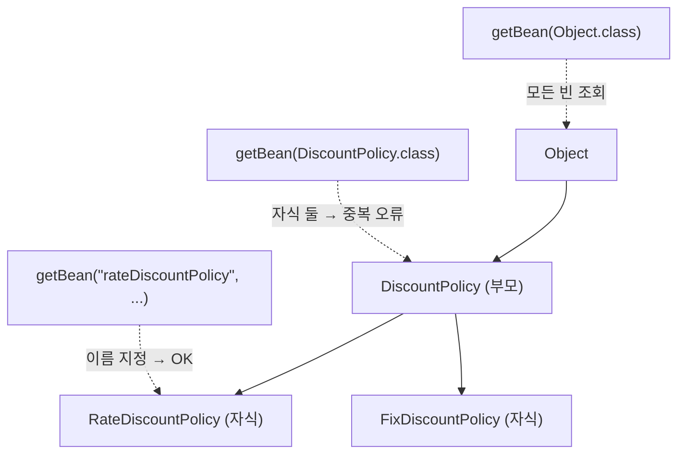
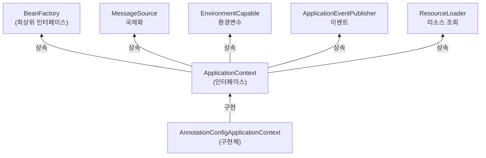
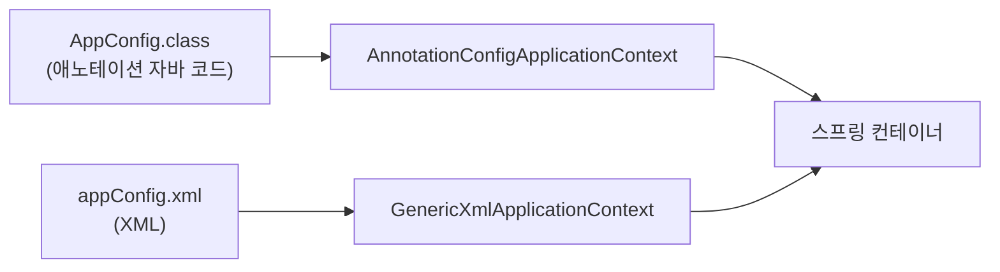
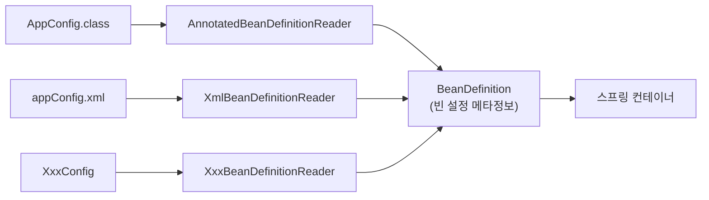

<!-- learning-chapter: core-04 -->

# 4. 스프링 컨테이너와 스프링 빈

> 강의자료: `4. 스프링 컨테이너와 스프링 빈.pdf`
> 실습 코드: `study/core` (groupId `hello`, artifactId `core`)
> 핵심: 03장 마지막에 등장한 **스프링 컨테이너**(`ApplicationContext`)가 무엇인지, 어떻게 생성되고 **빈을 등록·조회**하는지, 그리고 그 뒤를 받치는 **`BeanFactory`·`BeanDefinition`** 추상화까지 살펴본다.

> [!NOTE]
> 이 문서는 학습 **전** PDF 기준으로 미리 정리한 내용이다. 실습하며 챕터 단위로 커밋하고, 커밋 내용을 근거로 이후 보충한다.
> 도식은 강의 슬라이드 캡처 대신 **직접 작성한 Mermaid 다이어그램**으로 재구성했다. (저작권·git 안전)

---

## 1. 스프링 컨테이너 생성

```java
// 스프링 컨테이너 생성
ApplicationContext applicationContext =
        new AnnotationConfigApplicationContext(AppConfig.class);
```

- `ApplicationContext`는 **인터페이스**(스프링 컨테이너)이고, `AnnotationConfigApplicationContext`는 그 **구현체**다.
- 애노테이션 기반 자바 설정 클래스(`AppConfig`)를 구성 정보로 넘겨 컨테이너를 만든다.

> 스프링 컨테이너는 XML 기반으로도, 애노테이션 기반 자바 설정 클래스로도 만들 수 있다. 앞으로는 주로 **애노테이션 기반**을 사용한다.

### 생성 과정 (3단계)



**1단계 · 컨테이너 생성** — 구성 정보로 `AppConfig.class`를 지정한다.

**2단계 · 스프링 빈 등록** — 컨테이너가 `@Bean`이 붙은 메서드를 모두 호출해 반환 객체를 빈으로 등록한다. 빈 이름은 기본적으로 **메서드 이름**이다.



> [!WARNING]
> **빈 이름은 항상 서로 달라야 한다.** 같은 이름을 부여하면(`@Bean(name="...")` 중복 등) 다른 빈이 무시되거나 기존 빈을 덮어써 오류가 발생한다.

**3단계 · 의존관계 설정** — 컨테이너가 설정 정보를 참고해 의존관계를 **주입(DI)** 한다.



> [!TIP]
> 빈을 생성하고 의존관계를 주입하는 단계는 원래 나눠져 있지만, 자바 코드로 스프링 빈을 등록하면 생성자를 호출하면서 의존관계 주입도 한 번에 처리된다. 자세한 내용은 의존관계 자동 주입에서 다룬다.

---

## 2. 컨테이너에 등록된 모든 빈 조회

컨테이너에 실제 스프링 빈들이 잘 등록됐는지 확인한다. (`ApplicationContextInfoTest`)

```java
@Test
@DisplayName("모든 빈 출력하기")
void findAllBean() {
    String[] beanDefinitionNames = ac.getBeanDefinitionNames();
    for (String name : beanDefinitionNames) {
        Object bean = ac.getBean(name);
        System.out.println("name=" + name + " object=" + bean);
    }
}

@Test
@DisplayName("애플리케이션 빈 출력하기")
void findApplicationBean() {
    String[] beanDefinitionNames = ac.getBeanDefinitionNames();
    for (String name : beanDefinitionNames) {
        BeanDefinition bd = ac.getBeanDefinition(name);
        // ROLE_APPLICATION: 직접 등록한 애플리케이션 빈만
        if (bd.getRole() == BeanDefinition.ROLE_APPLICATION) {
            Object bean = ac.getBean(name);
            System.out.println("name=" + name + " object=" + bean);
        }
    }
}
```

- `getBeanDefinitionNames()`: 스프링에 등록된 **모든 빈 이름**을 조회.
- `getBean(name)`: 빈 이름으로 빈 객체(인스턴스)를 조회.
- `getRole()`로 빈을 구분한다.
  - `ROLE_APPLICATION`: 사용자가 정의한 빈 (직접 등록한 애플리케이션 빈)
  - `ROLE_INFRASTRUCTURE`: 스프링이 내부에서 사용하는 빈

> [!NOTE]
> 필터 없이 모두 출력하면 `ConfigurationClassPostProcessor`, `AutowiredAnnotationBeanPostProcessor`, `environment`, `systemProperties` 같은 **스프링 내부 인프라 빈**이 잔뜩 섞여 나온다. 이들이 바로 애노테이션 기능을 돌려주는 확장(PostProcessor)과 `ApplicationContext` 부가기능(6번 참고)의 실체다.

---

## 3. 스프링 빈 조회 - 기본

부모 타입으로 조회하는 가장 기본적인 방법. (`ApplicationContextBasicFindTest`)

```java
// 빈 이름 + 타입으로 조회
MemberService ms = ac.getBean("memberService", MemberService.class);

// 타입만으로 조회 (이름 생략)
MemberService ms = ac.getBean(MemberService.class);

// 조회 대상이 없으면 NoSuchBeanDefinitionException
assertThrows(NoSuchBeanDefinitionException.class,
        () -> ac.getBean("xxxxx", MemberService.class));
```

- 조회 대상 빈이 없으면 예외 발생: `NoSuchBeanDefinitionException: No bean named 'xxxxx' available`
- **구체 타입으로 조회**할 수도 있지만(`MemberServiceImpl.class`), 구현에 의존하므로 **역할(인터페이스)에 의존**하는 것이 유연하고 좋다.



타입만으로 조회할 때는 후보가 정확히 하나여야 한다. 후보가 여러 개라면 이름을 지정하거나 `getBeansOfType()`으로 모두 조회해 의도를 명확히 해야 한다.

---

## 4. 스프링 빈 조회 - 동일한 타입이 둘 이상

타입으로만 조회할 때 같은 타입의 빈이 둘 이상이면 오류가 발생하므로 **빈 이름**을 지정한다. (`ApplicationContextSameBeanFindTest`)

```java
// 같은 타입이 둘 이상이면 NoUniqueBeanDefinitionException 발생
assertThrows(NoUniqueBeanDefinitionException.class,
        () -> ac.getBean(MemberRepository.class)); // ❌ 중복 오류

// 빈 이름을 지정하면 해결
ac.getBean("memberRepository1", MemberRepository.class); // ✅

// 특정 타입을 모두 조회
Map<String, MemberRepository> beans = ac.getBeansOfType(MemberRepository.class);
```

- 타입으로 조회 시 같은 타입이 둘 이상이면 `NoUniqueBeanDefinitionException`.
- `getBeansOfType()`: 해당 타입의 **모든 빈**을 `Map<빈이름, 빈객체>`로 반환.

---

## 5. 스프링 빈 조회 - 상속 관계

> [!IMPORTANT]
> **부모 타입으로 조회하면 자식 타입도 함께 조회된다.** 그래서 모든 자바 객체의 최고 부모인 `Object` 타입으로 조회하면 **모든 스프링 빈**을 조회한다.



- 부모 타입으로 조회 시 자식이 둘 이상이면 중복 오류(`NoUniqueBeanDefinitionException`) → 빈 이름 지정 또는 자식 타입으로 조회.
- `getBeansOfType(부모타입)`으로 부모 타입의 모든 자식 빈을 조회할 수 있다.
- `getBeansOfType(Object.class)`를 하면 스프링 내부 빈까지 전부 걸린다(2번의 필터 없는 출력과 같은 상황).

---

## 6. BeanFactory와 ApplicationContext



### BeanFactory

- 스프링 컨테이너의 **최상위 인터페이스**.
- 스프링 빈을 관리하고 조회하는 역할을 담당. (`getBean()` 제공)

### ApplicationContext

- `BeanFactory` 기능을 **모두 상속**받아 제공.
- 빈 관리·조회 외에 애플리케이션 개발에 필요한 **수많은 부가기능**을 함께 제공한다.

| 인터페이스 | 부가기능 |
| --- | --- |
| `MessageSource` | **국제화 기능** (한국이면 한국어, 영어권이면 영어로 출력) |
| `EnvironmentCapable` | **환경변수** — 로컬/개발/운영 등 환경 구분 |
| `ApplicationEventPublisher` | **이벤트** 발행/구독 모델 지원 |
| `ResourceLoader` | 파일/클래스패스/외부 등 **리소스**를 편리하게 조회 |

> [!NOTE]
> `BeanFactory`를 직접 사용할 일은 거의 없고, 부가기능이 포함된 `ApplicationContext`를 사용한다. `BeanFactory`나 `ApplicationContext`를 **스프링 컨테이너**라 한다.

---

## 7. 다양한 설정 형식 지원 - 자바 코드, XML

스프링 컨테이너는 설정 정보를 **유연하게** 받아들이도록 설계되어 있다. (자바 코드, XML, Groovy 등)



```java
// 애노테이션 기반 자바 코드 설정
ApplicationContext ac = new AnnotationConfigApplicationContext(AppConfig.class);

// XML 기반 설정
ApplicationContext ac = new GenericXmlApplicationContext("appConfig.xml");
```

- 최근에는 스프링 부트를 주로 쓰며 XML 기반 설정은 잘 사용하지 않지만, 아직 많은 레거시 프로젝트가 XML을 쓴다.
- XML을 사용하면 **컴파일 없이** 빈 설정 정보를 변경할 수 있는 장점이 있다.

```xml
<!-- src/main/resources/appConfig.xml -->
<beans>
    <bean id="memberService" class="hello.core.member.MemberServiceImpl">
        <constructor-arg name="memberRepository" ref="memberRepository"/>
    </bean>
    <bean id="memberRepository" class="hello.core.member.MemoryMemberRepository"/>
</beans>
```

- `<bean id="...">`는 자바 설정의 메서드 이름, `class`는 구현 클래스, `<constructor-arg>`는 생성자 주입에 대응된다. `AppConfig.java`와 거의 1:1로 대응됨을 알 수 있다.

---

## 8. 스프링 빈 설정 메타 정보 - BeanDefinition

스프링이 이렇게 다양한 설정 형식을 지원할 수 있는 비밀은 **`BeanDefinition`** 이라는 추상화에 있다.

> **역할과 구현을 개념적으로 나눈 것.** 자바 코드든 XML이든, 스프링 컨테이너는 그 형식을 몰라도 되고 오직 `BeanDefinition`만 알면 된다.



- `BeanDefinition`을 **빈 설정 메타정보**라 한다. `@Bean`, `<bean>` 하나당 각각 하나의 메타정보가 생성된다.
- 스프링 컨테이너는 이 **메타정보를 기반으로 스프링 빈을 생성**한다.
- `AnnotationConfigApplicationContext`는 `AnnotatedBeanDefinitionReader`로 `AppConfig.class`를 읽어 `BeanDefinition`을 생성한다. XML도 마찬가지로 각자의 Reader가 처리한다.

### BeanDefinition 주요 정보

| 항목 | 설명 |
| --- | --- |
| `BeanClassName` | 생성할 빈의 클래스 이름 (자바 설정처럼 팩토리 역할이면 없을 수 있음) |
| `factoryBeanName` / `factoryMethodName` | 팩토리 역할의 빈 이름 / 빈을 생성할 팩토리 메서드 (예: `appConfig` / `memberService`) |
| `Scope` | 싱글톤(기본값) 등 스코프 |
| `lazyInit` | 실제 사용 시점까지 빈 생성을 지연할지 여부 |
| `InitMethodName` / `DestroyMethodName` | 빈 생성·소멸 시 호출되는 콜백 메서드명 |
| `Constructor arguments` / `Property values` | 의존관계 주입에 사용할 인자·속성 (팩토리 역할이면 없을 수 있음) |

> [!TIP]
> `@Bean`으로 등록한 빈은 `BeanClassName`이 **null**이고 대신 `factoryBeanName`(예: `appConfig`) / `factoryMethodName`(예: `memberService`)에 값이 들어간다. "이 클래스를 new 해라"가 아니라 "appConfig의 memberService() 메서드로 만들어라"로 정의되기 때문이다.

> [!TIP]
> `BeanDefinition`을 직접 정의하거나 사용하는 일은 실무에서 거의 없다. "스프링이 다양한 형태의 설정 정보를 `BeanDefinition`으로 추상화해서 사용하는구나" 정도로 이해하면 충분하다.

---

## 전체 흐름 정리

1. **컨테이너 생성** — `new AnnotationConfigApplicationContext(AppConfig.class)`로 생성 → `@Bean` 등록 → 의존관계 주입 (3단계)
2. **빈 조회 기본** — `getBean(이름, 타입)` / `getBean(타입)`, 없으면 예외
3. **타입 중복** — 같은 타입 둘 이상이면 이름 지정 또는 `getBeansOfType()`
4. **상속 관계** — 부모 타입 조회 시 자식도 조회, `Object`로 조회하면 전부
5. **BeanFactory / ApplicationContext** — 최상위 인터페이스와 부가기능(국제화·환경·이벤트·리소스)
6. **다양한 설정 형식** — 자바 코드, XML 모두 지원
7. **BeanDefinition** — 설정 형식을 추상화한 **빈 설정 메타정보**가 유연함의 비결
