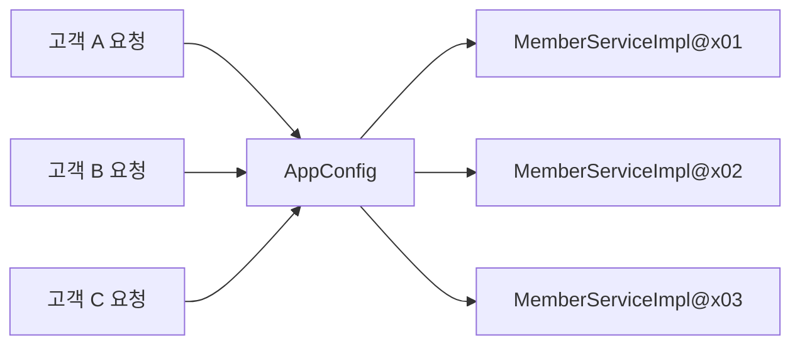
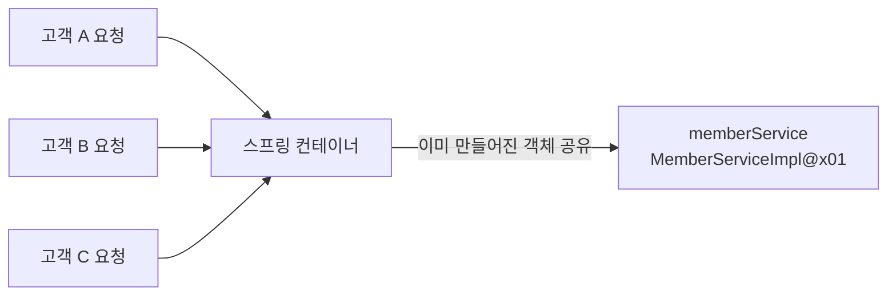
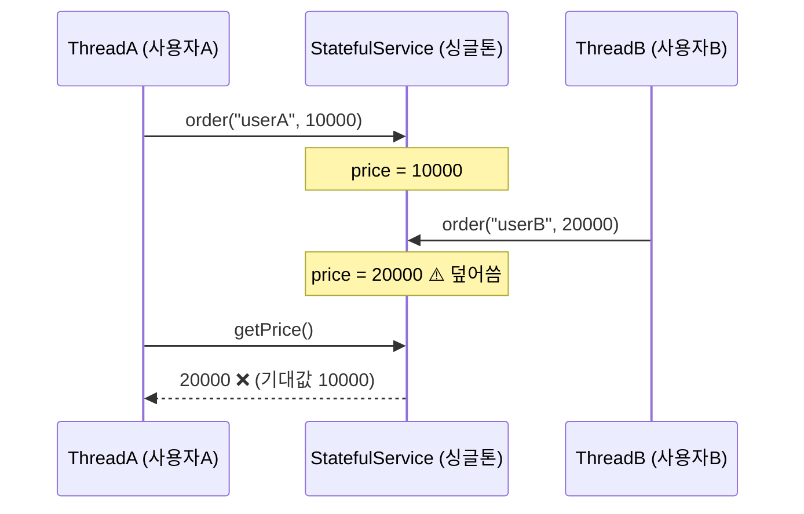
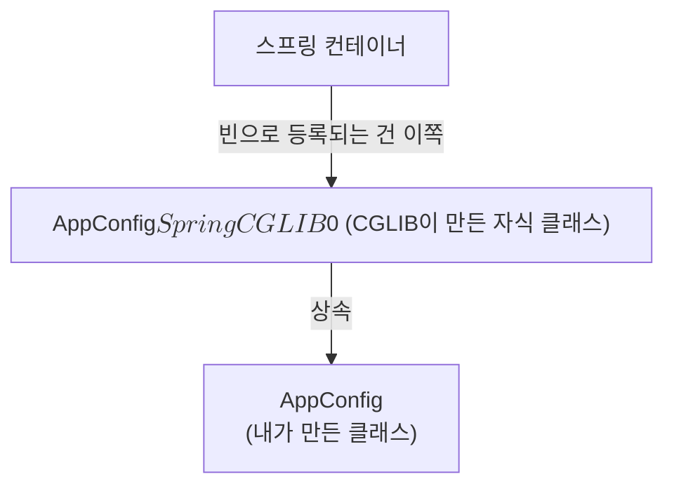

<!-- learning-chapter: core-05 -->

# 5. 싱글톤 컨테이너

> 강의자료: `5. 싱글톤 컨테이너.pdf`
> 실습 코드: `study/core` (groupId `hello`, artifactId `core`)
> 핵심: 웹 애플리케이션에서 왜 **싱글톤**이 필요한지, 순수 자바 **싱글톤 패턴**의 문제는 무엇인지, 스프링이 **싱글톤 컨테이너**로 그 문제를 어떻게 해결하는지, 그리고 `@Configuration`이 **바이트코드 조작**으로 싱글톤을 보장하는 원리까지 살펴본다.

> [!NOTE]
> 이 문서는 학습 **전** PDF 기준으로 미리 정리한 내용이다. 실습하며 챕터 단위로 커밋하고, 커밋 내용을 근거로 이후 보충한다.
> 도식은 강의 슬라이드 캡처 대신 **직접 작성한 Mermaid 다이어그램**으로 재구성했다. (저작권·git 안전)

---

## 1. 웹 애플리케이션과 싱글톤

스프링은 태생이 **기업용 온라인 서비스 기술**을 지원하기 위해 탄생했다. 대부분의 스프링 애플리케이션은 **웹 애플리케이션**이고, 웹 애플리케이션은 보통 **여러 고객이 동시에 요청**한다.

### 문제 상황 — 요청마다 객체 생성

04장까지 만든 순수한 DI 컨테이너(`AppConfig`)는 요청할 때마다 객체를 **새로** 만든다. (`SingletonTest.pureContainer`)

```java
@Test
@DisplayName("스프링 없는 순수한 DI 컨테이너")
void pureContainer() {
    AppConfig appConfig = new AppConfig();

    // 1. 조회: 호출할 때 마다 객체를 생성
    MemberService memberService1 = appConfig.memberService();
    // 2. 조회: 호출할 때 마다 객체를 생성
    MemberService memberService2 = appConfig.memberService();

    // 참조값이 다른 것을 확인
    assertThat(memberService1).isNotSameAs(memberService2);
}
```



- 고객 트래픽이 초당 100이 나오면 **초당 100개 객체가 생성되고 소멸**된다 → 메모리 낭비가 심하다.
- 해결책: 해당 객체가 **딱 1개만 생성**되고, 이를 **공유**하도록 설계하면 된다. → **싱글톤 패턴**

> [!TIP]
> 현대 JVM에서 객체 할당 자체는 TLAB 포인터 증가로 **수 나노초**, 짧게 살다 죽는 객체의 GC 회수 비용도 거의 0에 수렴한다. 그래서 "객체 생성이 느려서" 싱글톤을 쓰는 게 아니다. 실제 이유는 **대규모 트래픽에서 불필요한 생성·조립 작업과 GC 빈도를 없애는 것**에 가깝다.

---

## 2. 싱글톤 패턴

**클래스의 인스턴스가 딱 1개만 생성되는 것을 보장**하는 디자인 패턴. 그래서 객체 인스턴스를 2개 이상 생성하지 못하도록 막아야 한다.

```java
public class SingletonService {

    // 1. static 영역에 객체를 딱 1개만 생성해둔다.
    private static final SingletonService instance = new SingletonService();

    // 2. 객체 인스턴스가 필요하면 오직 이 static 메서드를 통해서만 조회하도록 허용
    public static SingletonService getInstance() {
        return instance;
    }

    // 3. 생성자를 private으로 선언해 외부에서 new 하지 못하게 막는다.
    private SingletonService() {
    }
}
```

- **1** — `static` 영역에 객체 `instance`를 미리 하나 생성해서 올려둔다.
- **2** — 이 객체가 필요하면 오직 `getInstance()`로만 조회할 수 있다. **항상 같은 인스턴스**를 반환한다.
- **3** — 생성자를 `private`으로 막아 외부에서 `new`로 새 객체를 만드는 것을 원천 차단한다.

```java
@Test
@DisplayName("싱글톤 패턴을 적용한 객체 사용")
void singletonServiceTest() {
    SingletonService singletonService1 = SingletonService.getInstance();
    SingletonService singletonService2 = SingletonService.getInstance();

    // 같은 인스턴스인지 확인
    assertThat(singletonService1).isSameAs(singletonService2);
}
```

> [!NOTE]
> **`same` vs `equal`**
> - `isSameAs` → **참조 비교** (`==`), 같은 인스턴스인지
> - `isEqualTo` → **값 비교** (`equals()`)

> [!WARNING]
> 싱글톤 패턴을 구현하는 방법은 여러 가지다. 여기서는 객체를 **미리 생성**해두는 가장 단순하고 안전한 방법을 사용했다.

### 싱글톤 패턴의 문제점

| 문제 | 설명 |
| --- | --- |
| 코드 자체가 많다 | `private` 생성자, `static` 필드, `getInstance()` 등 구현 코드가 필요 |
| **DIP 위반** | 클라이언트가 구체 클래스에 의존한다 (`SingletonService.getInstance()`) |
| **OCP 위반 가능성** | 구체 클래스 의존 → 확장에 닫혀 있을 가능성이 높다 |
| 테스트가 어렵다 | 미리 만들어진 객체를 고정 사용하므로 대체·mock 주입이 어렵다 |
| 유연성이 떨어진다 | `private` 생성자 때문에 자식 클래스를 만들기 어렵다, DI 적용이 어렵다 |
| 내부 속성 변경·초기화 어려움 | 외부에서 상태를 바꾸거나 초기화하기 까다롭다 |

> **결론: 안티패턴으로 불리기도 한다.**

---

## 3. 싱글톤 컨테이너

**스프링 컨테이너는 싱글톤 패턴의 문제점을 해결하면서, 객체 인스턴스를 싱글톤으로 관리한다.**

- 스프링 컨테이너가 곧 **싱글톤 컨테이너** 역할을 한다. 이렇게 싱글톤 객체를 생성·관리하는 기능을 **싱글톤 레지스트리**라 한다.
- 스프링 컨테이너의 이런 기능 덕분에 싱글톤 패턴의 **모든 단점을 해결**하면서 객체를 싱글톤으로 유지할 수 있다.
  - 싱글톤 패턴을 위한 **지저분한 코드가 들어가지 않아도 된다.**
  - **DIP, OCP, 테스트, `private` 생성자**로부터 자유롭게 싱글톤을 사용할 수 있다.

```java
@Test
@DisplayName("스프링 컨테이너와 싱글톤")
void springContainer() {
    ApplicationContext ac = new AnnotationConfigApplicationContext(AppConfig.class);

    MemberService memberService1 = ac.getBean("memberService", MemberService.class);
    MemberService memberService2 = ac.getBean("memberService", MemberService.class);

    // 참조값이 같은 것을 확인
    assertThat(memberService1).isSameAs(memberService2);
}
```



스프링 컨테이너 덕분에 고객의 요청이 올 때마다 객체를 생성하는 것이 아니라, **이미 만들어진 객체를 공유해서 효율적으로 재사용**할 수 있다.

> [!NOTE]
> 스프링의 기본 빈 등록 방식은 싱글톤이지만, 싱글톤 방식만 지원하는 것은 아니다. 요청할 때마다 새 객체를 생성해서 반환하는 기능도 제공한다. → **빈 스코프**(09장)에서 다룬다.

---

## 4. 싱글톤 방식의 주의점

> [!IMPORTANT]
> 싱글톤 방식은 여러 클라이언트가 **하나의 같은 객체 인스턴스를 공유**하기 때문에, 싱글톤 객체는 **상태를 유지(stateful)하게 설계하면 안 된다.**

### 무상태(stateless)로 설계해야 한다

- 특정 클라이언트에 **의존적인 필드**가 있으면 안 된다.
- 특정 클라이언트가 **값을 변경할 수 있는 필드**가 있으면 안 된다.
- 가급적 **읽기만** 가능해야 한다.
- 필드 대신 자바에서 공유되지 않는 **지역변수, 파라미터, ThreadLocal** 등을 사용해야 한다.

> **스프링 빈의 필드에 공유 값을 설정하면 정말 큰 장애가 발생할 수 있다!**

### 상태를 유지할 경우 발생하는 문제 예시

```java
public class StatefulService {

    private int price; // ❌ 상태를 유지하는 필드

    public void order(String name, int price) {
        System.out.println("name = " + name + " price = " + price);
        this.price = price; // ❌ 여기가 문제!
    }

    public int getPrice() {
        return price;
    }
}
```



- 사용자 A의 주문 금액이 사용자 B의 주문으로 **덮어써진다.**
- 실무에서 이런 문제가 가끔 발생하는데, **정말 해결하기 어려운 큰 문제들**이 터진다. 공유 필드는 항상 조심해야 한다.

### 해결

```java
public class StatefulService {

    public int order(String name, int price) {
        System.out.println("name = " + name + " price = " + price);
        return price; // ✅ 지역변수/반환값으로 처리 — 무상태
    }
}
```

---

## 5. `@Configuration`과 싱글톤

`AppConfig`를 다시 보면 이상한 점이 있다.

```java
@Configuration
public class AppConfig {

    @Bean
    public MemberService memberService() {
        return new MemberServiceImpl(memberRepository()); // memberRepository() 호출
    }

    @Bean
    public OrderService orderService() {
        return new OrderServiceImpl(memberRepository(), discountPolicy()); // 또 호출
    }

    @Bean
    public MemberRepository memberRepository() {
        return new MemoryMemberRepository(); // new가 2번 호출되는 것처럼 보인다
    }
    ...
}
```

- `memberService()`와 `orderService()`가 각각 `memberRepository()`를 호출한다.
- 코드만 보면 `new MemoryMemberRepository()`가 **2번 호출**되어 서로 다른 인스턴스가 생기고 **싱글톤이 깨지는 것처럼** 보인다.

### 검증 — 실제로는 모두 같은 인스턴스다

`MemberServiceImpl`, `OrderServiceImpl`에 테스트용 조회 메서드를 추가해 확인한다. (`ConfigurationSingletonTest`)

```java
@Test
void configurationTest() {
    ApplicationContext ac = new AnnotationConfigApplicationContext(AppConfig.class);

    MemberServiceImpl memberService = ac.getBean("memberService", MemberServiceImpl.class);
    OrderServiceImpl orderService = ac.getBean("orderService", OrderServiceImpl.class);
    MemberRepository memberRepository = ac.getBean("memberRepository", MemberRepository.class);

    // 모두 같은 인스턴스를 참조한다
    assertThat(memberService.getMemberRepository()).isSameAs(memberRepository);
    assertThat(orderService.getMemberRepository()).isSameAs(memberRepository);
}
```

`AppConfig`에 로그를 찍어보면 예상과 달리 `call AppConfig.memberRepository`가 **딱 1번만** 출력된다.

```
call AppConfig.memberService
call AppConfig.memberRepository   ← 1번만!
call AppConfig.orderService
```

> [!NOTE]
> 자바 코드상으로는 최소 3번 호출되어야 정상이다. 스프링이 뭔가 손을 썼다는 뜻이다. → 다음 절

---

## 6. `@Configuration`과 바이트코드 조작의 마법

스프링 컨테이너는 싱글톤 레지스트리다. 스프링 빈이 싱글톤이 되도록 보장해주어야 한다. 그런데 스프링이 자바 코드까지 어떻게 하기는 어렵다. 그래서 스프링은 **클래스의 바이트코드를 조작하는 라이브러리(CGLIB)** 를 사용한다.

```java
@Test
void configurationDeep() {
    ApplicationContext ac = new AnnotationConfigApplicationContext(AppConfig.class);

    AppConfig bean = ac.getBean(AppConfig.class);
    System.out.println("bean = " + bean.getClass());
    // 출력: class hello.core.AppConfig$$SpringCGLIB$$0
}
```

- 순수한 클래스라면 `class hello.core.AppConfig`가 출력되어야 한다.
- 실제로는 `AppConfig$$SpringCGLIB$$0` — 스프링이 **CGLIB이라는 바이트코드 조작 라이브러리**로 `AppConfig` 클래스를 상속받은 **임의의 다른 클래스**를 만들고, **그 클래스를 스프링 빈으로 등록**한 것이다.



### CGLIB이 심어놓은 로직 (예상)

```java
@Bean
public MemberRepository memberRepository() {
    if (memberRepository가 이미 스프링 컨테이너에 등록되어 있으면) {
        return 스프링 컨테이너에서 찾아서 반환;
    } else {
        기존 로직을 호출해서 MemoryMemberRepository를 생성하고 스프링 컨테이너에 등록;
        return 반환;
    }
}
```

- `@Bean`이 붙은 메서드마다 **이미 스프링 빈이 존재하면 존재하는 빈을 반환**하고, 없으면 생성해서 등록한 뒤 반환하는 코드가 동적으로 만들어진다.
- 덕분에 **싱글톤이 보장**된다.

### `@Configuration`을 붙이지 않고 `@Bean`만 적용하면?

| 구분 | `@Configuration` 적용 | `@Bean`만 적용 |
| --- | --- | --- |
| 등록되는 클래스 | `AppConfig$$SpringCGLIB$$0` | `AppConfig` (순수 클래스) |
| `memberRepository()` 호출 횟수 | **1번** | **3번** (각자 `new`) |
| 싱글톤 보장 | ✅ 보장됨 | ❌ 깨짐 |
| 의존관계 주입 | 컨테이너가 관리하는 빈 주입 | **컨테이너가 관리하지 않는** 다른 인스턴스 주입 |

- `@Bean`만 사용해도 스프링 빈으로 등록은 되지만, **싱글톤을 보장하지 않는다.**
- `memberRepository()`처럼 의존관계 주입이 필요해 메서드를 직접 호출할 때 싱글톤이 깨진다.

> [!IMPORTANT]
> **고민할 것 없이 스프링 설정 정보는 항상 `@Configuration`을 사용하자.**

---

## 전체 흐름 정리

1. **웹 애플리케이션과 싱글톤** — 여러 고객이 동시 요청 → 요청마다 객체 생성은 낭비
2. **싱글톤 패턴** — 인스턴스 1개를 보장하지만 DIP·OCP 위반, 테스트 어려움 등 단점이 많다 (안티패턴)
3. **싱글톤 컨테이너** — 스프링 컨테이너가 싱글톤 레지스트리로서 단점 없이 싱글톤을 관리해준다
4. **주의점** — 싱글톤 객체는 반드시 **무상태(stateless)** 로 설계할 것. 공유 필드는 장애의 원인
5. **`@Configuration`과 싱글톤** — `@Bean` 메서드를 여러 번 호출해도 같은 인스턴스가 반환된다
6. **바이트코드 조작** — CGLIB이 `AppConfig`를 상속한 자식 클래스를 만들어 싱글톤을 보장한다. 설정 정보에는 항상 `@Configuration`을 붙이자
