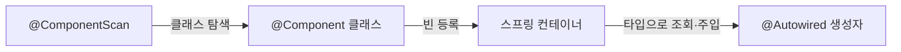
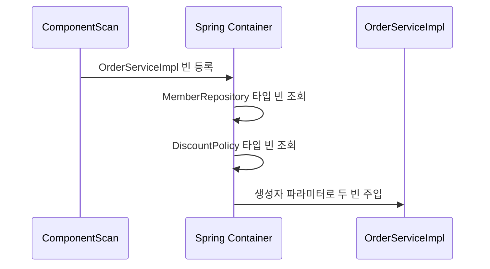
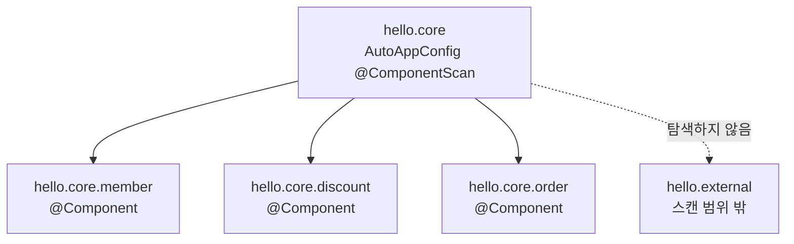
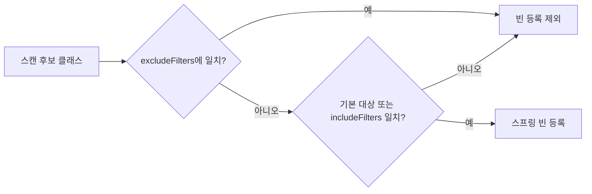
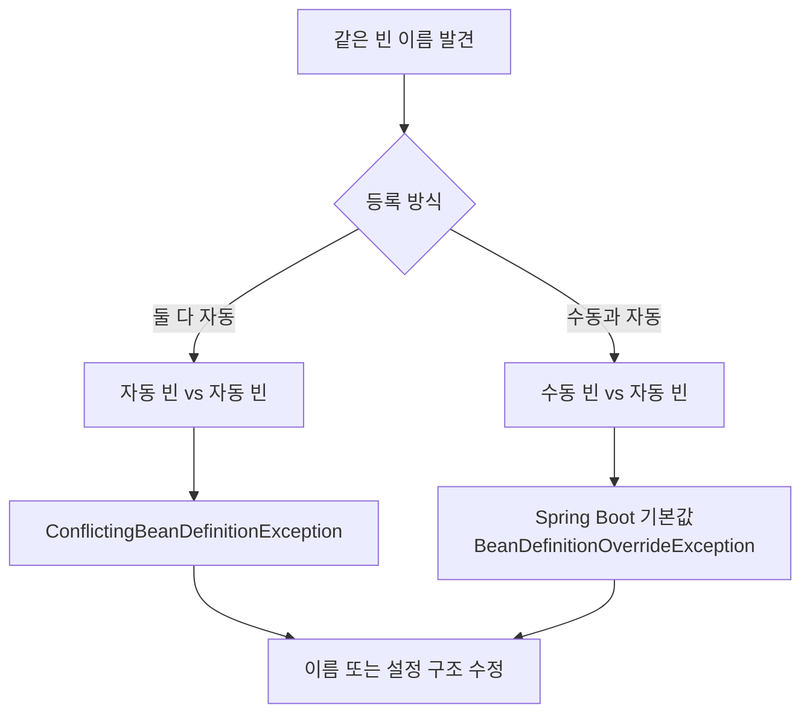

<!-- learning-chapter: core-06 -->

# 6. 컴포넌트 스캔

> 강의자료: `6. 컴포넌트 스캔.pdf`
> 실습 코드: `study/core` (groupId `hello`, artifactId `core`)
> 핵심: 설정 클래스에서 빈을 하나씩 등록하는 대신 `@ComponentScan`으로 빈을 자동 등록하고, `@Autowired`로 의존관계를 자동 주입하는 흐름을 이해한다. 이어서 탐색 범위, 스캔 대상, 필터, 빈 이름 충돌 규칙을 살펴본다.

> [!NOTE]
> 이 문서는 학습 **전** PDF 기준으로 미리 정리한 내용이다. 실습하며 챕터 단위로 커밋하고, 커밋 내용을 근거로 이후 보충한다.
> 도식은 강의 슬라이드 캡처 대신 **직접 작성한 Mermaid 다이어그램**으로 재구성했다. (저작권·git 안전)

---

## 1. 컴포넌트 스캔과 의존관계 자동 주입

지금까지는 `AppConfig`에서 `@Bean`을 사용해 스프링 빈을 직접 등록하고, 생성자에 넘겨줄 구현 객체도 직접 선택했다.

```java
@Configuration
public class AppConfig {

    @Bean
    public MemberService memberService() {
        return new MemberServiceImpl(memberRepository());
    }

    @Bean
    public MemberRepository memberRepository() {
        return new MemoryMemberRepository();
    }
}
```

등록할 빈이 많아지면 설정 코드도 함께 커지고, 누락이나 중복 같은 실수가 발생하기 쉽다. 스프링은 이를 자동화하는 두 기능을 제공한다.

- `@ComponentScan`: `@Component`가 붙은 클래스를 찾아 스프링 빈으로 등록한다.
- `@Autowired`: 스프링 컨테이너에서 필요한 타입의 빈을 찾아 의존관계를 자동으로 주입한다.



### 자동 설정 클래스 만들기

기존 `AppConfig`는 수동 설정 비교를 위해 그대로 두고, 자동 등록용 `AutoAppConfig`를 새로 만든다.

```java
package hello.core;

import org.springframework.context.annotation.ComponentScan;
import org.springframework.context.annotation.Configuration;
import org.springframework.context.annotation.FilterType;

@Configuration
@ComponentScan(
        excludeFilters = @ComponentScan.Filter(
                type = FilterType.ANNOTATION,
                classes = Configuration.class
        )
)
public class AutoAppConfig {
}
```

예제에서 `@Configuration`을 제외하는 이유는 기존 `AppConfig` 등 수동 설정 클래스까지 함께 스캔되는 것을 막기 위해서다. 실제 프로젝트에서는 보통 기존 수동 설정을 남겨두기 위한 이 필터가 필요하지 않다.

> [!NOTE]
> `@Configuration` 자체에도 `@Component`가 포함되어 있어 컴포넌트 스캔 대상이 된다.

### 대상 클래스에 `@Component` 추가

```java
@Component
public class MemoryMemberRepository implements MemberRepository {
}
```

```java
@Component
public class RateDiscountPolicy implements DiscountPolicy {
}
```

```java
@Component
public class MemberServiceImpl implements MemberService {

    private final MemberRepository memberRepository;

    @Autowired
    public MemberServiceImpl(MemberRepository memberRepository) {
        this.memberRepository = memberRepository;
    }
}
```

```java
@Component
public class OrderServiceImpl implements OrderService {

    private final MemberRepository memberRepository;
    private final DiscountPolicy discountPolicy;

    @Autowired
    public OrderServiceImpl(
            MemberRepository memberRepository,
            DiscountPolicy discountPolicy
    ) {
        this.memberRepository = memberRepository;
        this.discountPolicy = discountPolicy;
    }
}
```

수동 설정에서는 `AppConfig`가 구현 객체를 생성하면서 의존관계까지 직접 연결했다. 자동 설정에는 이런 코드가 없으므로, 각 구현 클래스의 생성자에 `@Autowired`를 붙여 스프링 컨테이너가 의존관계를 주입하게 한다.

> [!TIP]
> 생성자가 하나뿐이면 `@Autowired`를 생략할 수 있다. 자세한 자동 주입 방식과 우선순위는 7장에서 다룬다.

### 동작 확인

```java
class AutoAppConfigTest {

    @Test
    void basicScan() {
        ApplicationContext ac =
                new AnnotationConfigApplicationContext(AutoAppConfig.class);

        MemberService memberService = ac.getBean(MemberService.class);

        assertThat(memberService).isInstanceOf(MemberServiceImpl.class);
    }
}
```

실행 로그에서는 스캐너가 후보 클래스를 발견하고 빈으로 등록하는 과정을 확인할 수 있다.

```text
ClassPathBeanDefinitionScanner - Identified candidate component class:
... RateDiscountPolicy.class
... MemberServiceImpl.class
... MemoryMemberRepository.class
... OrderServiceImpl.class
```

---

## 2. 자동 등록과 자동 주입의 동작 원리

### `@ComponentScan`의 빈 등록

`@ComponentScan`은 탐색 범위 안에서 `@Component`가 붙은 클래스를 찾고 스프링 빈으로 등록한다.

빈 이름의 기본값은 클래스명의 첫 글자를 소문자로 바꾼 값이다.

| 클래스 | 기본 빈 이름 |
| --- | --- |
| `MemberServiceImpl` | `memberServiceImpl` |
| `MemoryMemberRepository` | `memoryMemberRepository` |
| `RateDiscountPolicy` | `rateDiscountPolicy` |

직접 이름을 지정할 수도 있다.

```java
@Component("memberService2")
public class MemberServiceImpl implements MemberService {
}
```

### `@Autowired`의 의존관계 주입

생성자에 `@Autowired`가 있으면 스프링 컨테이너가 생성자 파라미터의 **타입**을 기준으로 알맞은 빈을 찾아 주입한다.

```java
@Autowired
public OrderServiceImpl(
        MemberRepository memberRepository,
        DiscountPolicy discountPolicy
) {
    this.memberRepository = memberRepository;
    this.discountPolicy = discountPolicy;
}
```

개념적으로 다음 조회와 비슷하다.

```java
MemberRepository repository =
        ac.getBean(MemberRepository.class);
DiscountPolicy policy =
        ac.getBean(DiscountPolicy.class);
```



같은 타입의 빈이 여러 개라면 단순 타입 조회만으로 하나를 고를 수 없다. 이 문제의 해결 방법은 7장의 `@Autowired` 조회 대상이 여러 개일 때에서 다룬다.

---

## 3. 탐색 위치

모든 클래스를 전부 탐색하면 시간이 오래 걸릴 수 있으므로 시작 위치를 지정할 수 있다.

```java
@ComponentScan(basePackages = "hello.core")
```

- `basePackages`: 지정한 패키지를 포함해 모든 하위 패키지를 탐색한다.
- 여러 위치를 지정하려면 `basePackages = {"hello.core", "hello.service"}`처럼 배열로 작성한다.
- `basePackageClasses`: 지정한 클래스가 속한 패키지를 탐색 시작 위치로 사용한다. 문자열보다 리팩터링에 안전하다.
- 아무것도 지정하지 않으면 `@ComponentScan`이 붙은 설정 클래스의 패키지가 시작 위치가 된다.

### 권장 위치

패키지 위치를 직접 나열하기보다 설정 클래스를 프로젝트 최상단 패키지에 두는 방법이 권장된다.



`AutoAppConfig.class`가 `hello.core`에 있으면 별도 설정 없이 `hello.core`와 모든 하위 패키지를 탐색한다.

스프링 부트 프로젝트의 `@SpringBootApplication` 안에도 `@ComponentScan`이 포함되어 있다. 따라서 메인 애플리케이션 클래스를 프로젝트의 최상단 패키지에 두는 것이 일반적이다.

---

## 4. 컴포넌트 스캔 기본 대상

컴포넌트 스캔은 `@Component`뿐 아니라 다음 애노테이션도 대상으로 인식한다. 각 애노테이션 안에 `@Component`가 포함되어 있기 때문이다.

| 애노테이션 | 주 용도 | 스프링의 부가 처리 |
| --- | --- | --- |
| `@Component` | 일반 컴포넌트 | 컴포넌트 스캔 대상 |
| `@Controller` | 스프링 MVC 컨트롤러 | MVC 컨트롤러로 인식 |
| `@Service` | 비즈니스 로직 | 특별한 부가 처리 없음. 계층의 역할을 명확히 표시 |
| `@Repository` | 데이터 접근 계층 | 데이터 접근 예외를 스프링 예외로 변환 |
| `@Configuration` | 설정 정보 | 스프링 빈이 싱글톤을 유지하도록 추가 처리 |

```java
@Component
public @interface Controller {
}
```

```java
@Component
public @interface Service {
}
```

```java
@Component
public @interface Configuration {
}
```

> [!NOTE]
> 애노테이션이 다른 애노테이션을 포함한 것을 인식하는 기능은 자바 언어 자체가 아니라 스프링이 지원하는 기능이다.

`useDefaultFilters`의 기본값은 `true`다. 이를 `false`로 바꾸면 위 기본 스캔 대상들이 제외되므로 특별한 목적이 없다면 기본값을 유지한다.

---

## 5. 필터

- `includeFilters`: 컴포넌트 스캔 대상을 추가로 지정한다.
- `excludeFilters`: 컴포넌트 스캔에서 제외할 대상을 지정한다.

### 사용자 정의 애노테이션

```java
@Target(ElementType.TYPE)
@Retention(RetentionPolicy.RUNTIME)
@Documented
public @interface MyIncludeComponent {
}
```

```java
@Target(ElementType.TYPE)
@Retention(RetentionPolicy.RUNTIME)
@Documented
public @interface MyExcludeComponent {
}
```

```java
@MyIncludeComponent
public class BeanA {
}
```

```java
@MyExcludeComponent
public class BeanB {
}
```

### 필터 적용과 검증

```java
class ComponentFilterAppConfigTest {

    @Test
    void filterScan() {
        ApplicationContext ac =
                new AnnotationConfigApplicationContext(
                        ComponentFilterAppConfig.class
                );

        BeanA beanA = ac.getBean("beanA", BeanA.class);
        assertThat(beanA).isNotNull();
        assertThatThrownBy(() -> ac.getBean("beanB", BeanB.class))
                .isInstanceOf(NoSuchBeanDefinitionException.class);
    }

    @Configuration
    @ComponentScan(
            includeFilters = @ComponentScan.Filter(
                    type = FilterType.ANNOTATION,
                    classes = MyIncludeComponent.class
            ),
            excludeFilters = @ComponentScan.Filter(
                    type = FilterType.ANNOTATION,
                    classes = MyExcludeComponent.class
            )
    )
    static class ComponentFilterAppConfig {
    }
}
```

`BeanA`는 `includeFilters`에 의해 등록되고, `BeanB`는 `excludeFilters`에 의해 등록되지 않는다.



제외 조건을 먼저 생각하면 이해하기 쉽다. 제외 대상은 등록하지 않고, 남은 후보 중 기본 컴포넌트이거나 include 조건에 맞는 클래스만 빈으로 등록한다.

### `FilterType`의 종류

| 타입 | 기준 | 예시 |
| --- | --- | --- |
| `ANNOTATION` | 애노테이션 | `org.example.SomeAnnotation` |
| `ASSIGNABLE_TYPE` | 지정한 타입과 그 자식 타입 | `org.example.SomeClass` |
| `ASPECTJ` | AspectJ 패턴 | `org.example..*Service+` |
| `REGEX` | 정규 표현식 | `org\.example\.Default.*` |
| `CUSTOM` | `TypeFilter` 구현 | `org.example.MyTypeFilter` |

`@Component`만으로 대부분의 빈을 충분히 등록할 수 있으므로 `includeFilters`를 사용할 일은 드물다. `excludeFilters`도 꼭 필요한 경우에만 사용하고, 스프링 부트의 기본 컴포넌트 스캔 규칙을 따르는 편이 단순하다.

---

## 6. 중복 등록과 충돌

빈 이름이 충돌하는 상황은 두 가지로 나눌 수 있다.



### 자동 등록 vs 자동 등록

서로 다른 컴포넌트가 같은 빈 이름으로 자동 등록되면 스프링은 `ConflictingBeanDefinitionException`을 발생시킨다.

```java
@Component("service")
public class MemberServiceImpl {
}

@Component("service")
public class OrderServiceImpl {
}
```

이름을 명시했다면 각 빈이 고유한 이름을 갖도록 수정해야 한다.

### 수동 등록 vs 자동 등록

```java
@Component
public class MemoryMemberRepository implements MemberRepository {
}
```

```java
@Configuration
@ComponentScan
public class AutoAppConfig {

    @Bean(name = "memoryMemberRepository")
    public MemberRepository memberRepository() {
        return new MemoryMemberRepository();
    }
}
```

과거에는 수동 빈이 자동 빈을 덮어쓰도록 허용했지만, 의도하지 않은 덮어쓰기는 잡기 어려운 버그를 만든다. 최근 스프링 부트는 기본적으로 빈 이름 충돌 시 애플리케이션 시작을 실패시킨다.

```text
***************************
APPLICATION FAILED TO START
***************************

Description:

The bean 'memoryMemberRepository', defined in class path resource [hello/core/AutoAppConfig.class], could not be registered. A bean with that name has already been defined in file [D:\Spring\study\core\build\classes\java\main\hello\core\member\MemoryMemberRepository.class] and overriding is disabled.

Action:

Consider renaming one of the beans or enabling overriding by setting
spring.main.allow-bean-definition-overriding=true
```

> [!IMPORTANT]
> 빈 오버라이딩을 켜서 충돌을 숨기기보다, 중복 등록의 원인을 찾아 빈 이름이나 설정 구성을 명확하게 수정하자.

---

## 전체 흐름 정리

1. **자동 등록** — `@ComponentScan`이 `@Component`가 붙은 클래스를 찾아 스프링 빈으로 등록한다.
2. **자동 주입** — `@Autowired`가 타입을 기준으로 필요한 빈을 찾아 생성자에 주입한다.
3. **탐색 위치** — 설정 클래스를 프로젝트 최상단 패키지에 두면 별도 `basePackages` 없이 하위 패키지를 탐색할 수 있다.
4. **기본 대상** — `@Controller`, `@Service`, `@Repository`, `@Configuration`도 `@Component`를 포함해 스캔 대상이 된다.
5. **필터** — `includeFilters`, `excludeFilters`로 대상을 조정할 수 있지만 기본 규칙을 우선한다.
6. **빈 이름 충돌** — 자동 빈끼리 충돌하면 예외가 발생하고, 스프링 부트에서는 수동 빈과 자동 빈의 충돌도 기본적으로 허용하지 않는다.

## 실습 체크리스트

- [ ] `AutoAppConfig`를 만들고 컴포넌트 스캔을 적용한다.
- [ ] 네 구현 클래스에 `@Component`를 추가한다.
- [ ] 서비스 구현체 생성자에 `@Autowired`를 적용한다.
- [ ] `AutoAppConfigTest.basicScan()`으로 빈 등록과 주입을 검증한다.
- [ ] 탐색 시작 위치를 변경하며 등록되는 빈의 범위를 확인한다.
- [ ] 사용자 정의 애노테이션과 필터 테스트를 작성한다.
- [ ] 자동 등록끼리의 빈 이름 충돌을 재현한다.
- [ ] 수동 등록과 자동 등록의 충돌 시 스프링 부트 동작을 확인한다.
